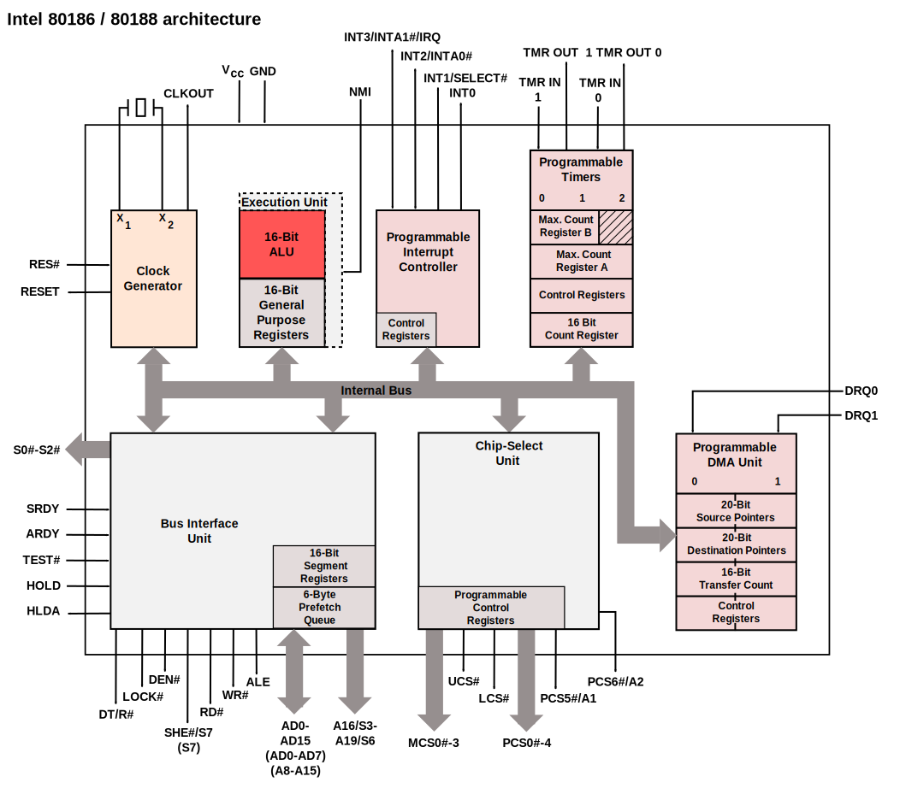

# Intel

## 史前时代: 8086 - NetBurst

### [16 bit 的感动](https://bgm.tv/subject/314759)

- 8086

一切都要从传奇的 [8086](https://en.wikipedia.org/wiki/Intel_8086) 开始, 这是 Intel x86 架构的开山之作, 时至今日, 后者依旧是世界上最流行的 CPU 架构 (或许没有之一).

尽管 8086 发布于 1978 年，至今 (2025 年) 已经有 47 年的历史，我们的《汇编语言》《汇编与接口》等课程仍然在学习最古老的 8086 与其所使用的 x86 指令集. 这也不意外，毕竟 Intel 为了让那些古老的程序依旧能够跑在现代 CPU 上, 付出了不知道多少努力. 在现代 x86-64 架构的 CPU 中，你仍然可以看到 8086 的影子, 比如启动时的实模式, 以及 `cs, ds, es, ss` 等段寄存器, 都是 8086 的遗产.

8086 的 [die shot](https://en.wikipedia.org/wiki/Die_shot) 如下图所示, 由 Ken Shirriff 拍摄并标注, 来源是: [A look at the die of the 8086 processor](http://www.righto.com/2020/06/a-look-at-die-of-8086-processor.html) 

8086 最开始使用 3 μm 工艺, 在 1981 年之后切换至了 2 μm 工艺, 晶体管数量为 29,000, 速度为 5 MHz.

- 80186

随后的 [80186](https://en.wikipedia.org/wiki/Intel_80186) 依旧是 16 位微处理器, 是对 8086 进行的小改进, 相较于 8086, 其 reg+imm 的寻址方式更快，乘法器和除法器、移位运算的速度快几倍.

80186 也引入了一些新的指令, `enter/leave` 用于快速构建函数栈帧, `bound` 用于检查数组下标是否越界, `pusha/popa` 用于快速保存/恢复寄存器, `ins/outs` 用于字符串 I/O 操作等. 其中 `enter/leave` 以及 `bound` 指令与当时流行的编程语言 Pascal 有着紧密的联系, 体现出软硬件协同设计的思想.

80186 简化后的微架构如下, 来自维基百科，由 [Appaloosa](https://commons.wikimedia.org/wiki/User:Appaloosa) 制作:

特点:

- 加入了 DMA 控制器, 用于高速数据传输以及与外设的通信

80186 采用 3 μm 工艺, 与 8086 相同, 晶体管数量为 55,000, 速度为 6 MHz.

### 保护模式与 32 位处理器

- 80286 (16 位)

80286 是第一款具有保护模式的 x86 处理器, 数据总线仍然是 16 位, 但将地址总线扩展为 24 位, 可以寻址 16 MiB 的内存. 保护模式首次在硬件层面提供了虚拟内存管理, 采取分段管理内存的机制, 这使得现代的多任务操作系统成为可能. 通过分段机制, 80286 支持高达 1 GiB 的虚拟内存空间.

保护模式下不兼容实模式时代的 MS-DOS 程序, 因此 286 不能够运行多个 MS-DOS 程序, 在后面的 386 中, Intel 添加了虚拟 8086 模式, 增强了对 MS-DOS 程序的兼容性.

80286 的简化微架构如下, 同样由 由 [Appaloosa](https://commons.wikimedia.org/wiki/User:Appaloosa) 制作:

比较显著的特点:

- 首次添加片上内存管理单元 (MMU), 用于逻辑地址与物理地址的转换
    - 数据总线与地址总线分离
    - 内存地址的计算不再需要占用 ALU, 提高了 CPI
- 添加了对内存段的权限检查和访问越界检查, 有效阻止非法访问
- 指令预取从 6 byte 升级为 8 byte

80286 采用 1.5 μm 工艺, 晶体管数量为 134,000, 速度为 5/6/8 MHz, 随后还推出了 16/20/25 MHz 的版本.

- 80386 (i386)

80386 是第三代 x86 架构的微处理器，首个 32 位 x86 处理器. 80386 继承了 80286 的保护模式, 并添加虚拟 8086 模式以兼容 MS-DOS 程序. 同时, 80386 还引入了分页机制, 与分段机制相结合, 为操作系统提供了更加灵活的内存管理方式.

80386 的简化微架构如下:

- i486

- P5

- P6

## Tick-Tock: Core - Sunny Cove

## 异构时代

### 小核: Tremont - Skymont

### 大核: Willow Cove - Lion Cove
