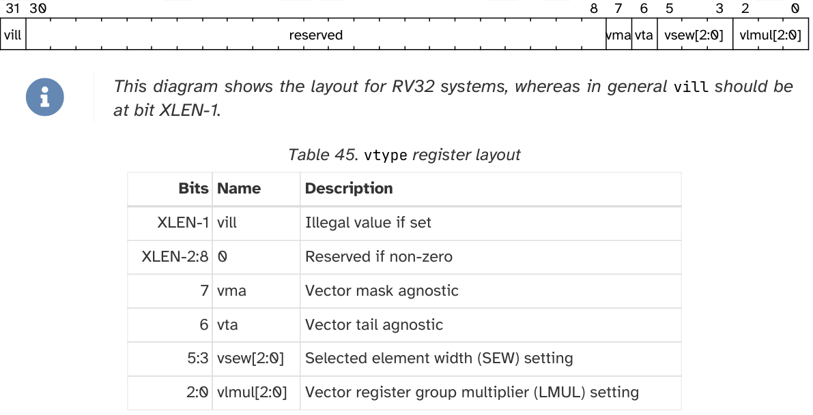
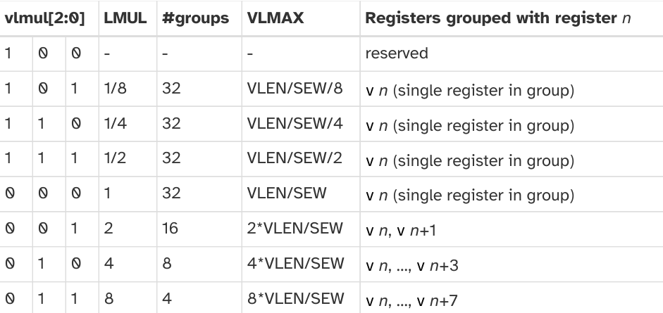
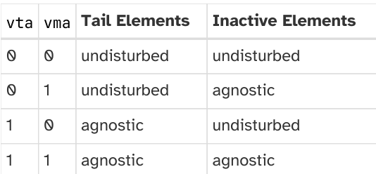

# RISC-V V

## 简介

RISC-V 的 V 扩展是 RISC-V 的向量化指令扩展，其设计思路采用向量机的形式，与 ARM SVE 颇为相似。RISC-V V 的 1.0 标准在 2021 年 11 月正式被批准 (Ratified)，且未来的改动需要保持对该正式版标准的兼容性。

## 基本概念

### ELEN 与 VLEN

对于每个支持向量扩展的硬件线程 (hart / hardware thread) 都有如下的两个硬件参数:

- ELEN: 单条指令能处理的最大向量位宽, ELEN $\ge 8$
- VLEN: 一个向量寄存器的位宽

ELEN 和 VLEN 都必须满足是 $2$ 的幂次，目前的标准中要求 VLEN $\ge$ ELEN, 也就是单条指令处理的数据位宽不能超过单个向量寄存器的位宽。但手册里指出未来也有可能允许 ELEN > VLEN 的情况，也就是将数据存储在多个向量寄存器里。

与 ARM SVE 的设计类似，RISC-V V 扩展也在设计上就保障了代码的便携性，只要处理器支持对应的指令和数据类型，即使 VLEN 和 ELEN 不同，相同二进制都能正确地运行。

### 编程模型

#### 向量寄存器

V 扩展规定了 32 个向量寄存器 v0 - v31, 每个寄存器宽度为 VLEN. 还有 7 个非特权 CSR，详见下表:

| 地址 | 特权级别 | 名称 | 简介 |
|:---------:|:-----------:|:------:|-------------|
| 0x008   | URW       | vstart | Vector start element index |
| 0x009   | URW       | vxsat | Fixed-Point Saturate Flag |
| 0x00A   | URW       | vxrm | Fixed-Point Rounding Mode |
| 0x00F   | URW       | vcsr | Vector control and status register |
| 0xc20   | URO       | vl | Vector length |
| 0xc21   | URO       | vtype | Vector data type register |
| 0xc22   | URO       | vlenb | VLEN/8 (vector register length in bytes) |

vstart, vxsat, vxrm 和 vcsr 可读可写，用于控制处理器向量运算的行为，而 vl, vtype 和 vlenb 只读。

1. vtype 寄存器

vtype 寄存器只能由 `vset{i}vl{i}` 系列的指令更新，简化了维护该寄存器状态的硬件逻辑。 下面是 vtype 寄存器各字段的详细介绍:

- vsew[2:0] (Vector Selected Element Width): 记录了向量寄存器中单个元素的位宽

    比如 SEW=32, VLEN=128 的时候，一个向量寄存器包含 4 个 32 位的元素，而 SEW=16, VLEN=256 时，一个向量寄存器包含 16 个 16 位元素。一个向量寄存器所容纳的元素个数就是 VLEN / SEW.

    | vsew[2:0] | SEW |
    | :---: | :---: |
    | `000` | 8 |
    | `001` | 16 |
    | `010` | 32 |
    | `011` | 64 |
    | `1XX` | 保留 |

- vlmul[2:0] (Vector Register Grouping): 记录了多个向量寄存器时如何编排的

    vlmul 寄存器记录的是 LMUL (Vector Length Multiplier) 的设置，它指示了将多少个向量寄存器打包成一组，让一条指令操作一组寄存器，它的使用场景如下:

    - 如果需要对大量的数据进行完全相同的操作，将 LMUL 设置为 2, 4 甚至 8, 可以将多个向量寄存器组合起来，用一条指令同时操作多个寄存器，进而达到更大的带宽。
    - 而如果要对单个向量的部分数据进行操作，也可以将 LMUL 设置为分数，比如 1/2, 1/4 和 1/8，但是处理的位宽一定要大于单个元素的位宽，也就是 LMUL $\ge$ SEW$_\text{min}$ / ELEN.

    RISC-V V 处理器必须支持 LMUL = 1, 2, 4 和 8, 但分数的 LMUL 并不是必须的。

    !!! danger "常见误区"

        受限于数据访存的带宽、后端有限的运算资源等等制约因素，并非将 LMUL 设置得越大越好，需要具体问题具体分析。

    更具体的总结请参见下表:

    

    由于将多个寄存器打包成了一组，指令操作这一组寄存器时，用的是第一个寄存器的编号，比如 LMUL=8 时，操作的寄存器编号就需要是 8 的倍数。操作非 LMUL 倍数编号的向量寄存器的指令是保留的，未来可能会指定。

    掩码寄存器永远只使用一个向量寄存器，无视 LMUL 的值。

- vta (Vector Tail Agnostic) 和 vma (Vector Mask Agnostic)

    

- vill (Vector Type Illegal): 当 `vset{i}vl{i}` 系列指令试图写入非法值时置 1.

    注: 把 vill 设置在最高位，是为了通过复用 branch on the sign bit 的电路来判断是否合法。

2. vl (Vector Length) 寄存器:

3. vlenb (Vector Byte Length) 寄存器: 一个向量寄存器存储多少字节，也就是 VLEN / 8.

#### 向量上下文

在进程切换时，处理器需要保存对应进程的上下文，如果开启了向量寄存器，那么保存上下文时，也需要将向量寄存器的内容写入内存，会比较耗时。因此，类似浮点数扩展，RISC-V V 在 `mstatus[10:9]` (也映射到 `sstatus[10:9]`) 添加了向量上下文状态 VS 字段，有四种状态，Initial, Clean, Dirty 和 Off. 如果 `mstatus.VS` 设置为 Off, 那么任何向量化指令，以及读写向量 CSR 的指令都会触发 illegal-instruction 异常。

为了避免进程切换的 overhead, 应当尽可能让 `mstatus.VS` 正确反映当前的向量寄存器状态。
