# 微处理器及其结构

## 寄存器

### 段寄存器

### 通用寄存器

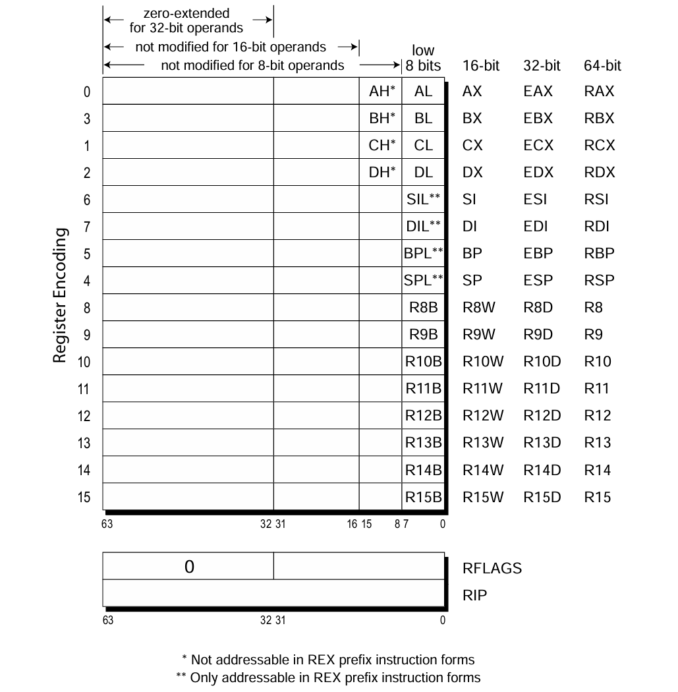

**注**:

1. 部分寄存器
    - 写入 ah, al 时, ax / eax / rax 高位不变
    - 写入 ax 时, eax / rax 高位不变
    - 写入 eax 时 rax 高位**自动清零**
        - 这样避免了 eax 与 rax 的相关性，方便寄存器重命名

2. 寄存器编码: 顺序是 ax, cx, bx, dx, sp, bp, si, di

3. REX 前缀:
    - ah, bh, ch, dh 变成了 spl, bpl, sil, dil
    - 详见 [REX 前缀](./section-4.md#rex-前缀)

### 状态寄存器

- 16 位: flags
- 32 位: eflags
- 64 位: rflags

状态标志位: CF, PF, AF, ZF, SF, TF, IF, DF, OF

## 系统运行模式与内存寻址

### 总览

1. Legacy Mode:

    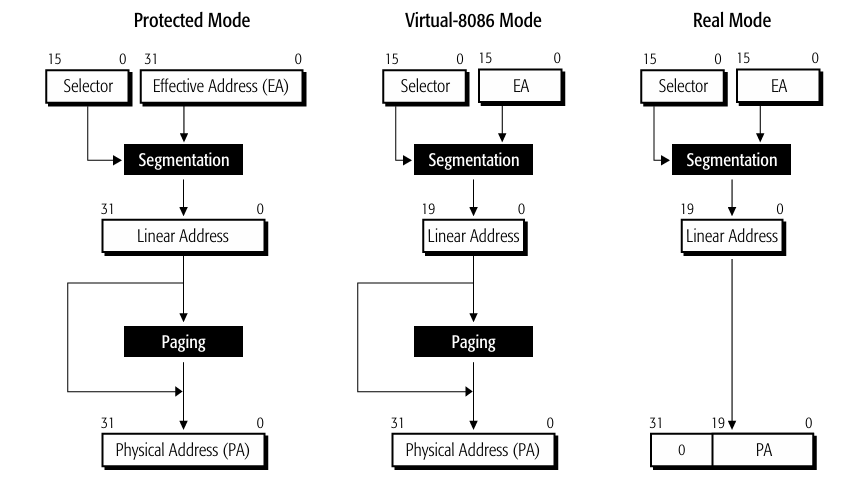

    - 实模式 (Real Mode): 16 位段寄存器作为选择值 (Selector), 有效地址 16 位, 经过运算得到 20 位物理地址，直接访问内存 (最大 1 MiB).
    - 虚拟 8086 模式 (Virtual 8086 Mode): 在 8086 寻址基础上，添加了可选的分页机制，扩大了可访问内存的范围.
    - 保护模式 (Protected Mode): 段寄存器只使用 16 位，作为选择值, 有效地址使用 32 位，通过段的描述符得到 Linear Address，再经过可选的分页机制得到物理地址.

2. Long Mode:

    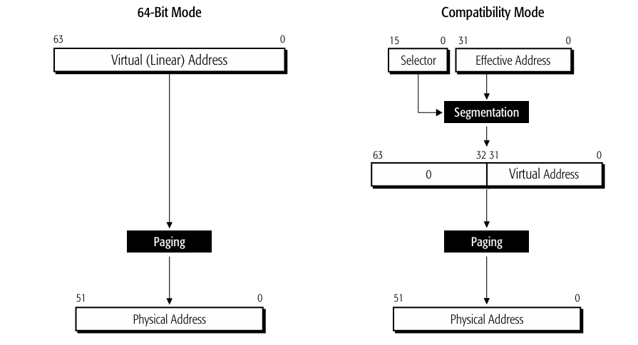

    - 兼容模式 (Compatibility Mode): 类似保护模式，Virtual Address 为 32 位.
    - 64 位模式 (64-bit Mode): 64 位地址，只使用分页机制.

### 实模式

#### 寻址方式

实模式下，没有虚拟内存的概念，所有内存地址均为物理地址。实模式采用 Fixed Segment，即定长分段的内存管理模式。

与操作系统课程中学习的分段有一点点不同，实模式的分段实际上就是一个硬件设计的技巧: 在 Intel 8086 处理器上，其地址总线为 20 位，可以寻址 1 MiB 的内存空间。然而 8086 的寄存器却只有 16 位，因此，8086 将内存地址分为段地址 (segment) 和偏移地址 (offset)，并在计算地址时，将来自段寄存器的段地址左移四位，并与偏移地址相加，得到 20 位物理地址:

\[
\text{Physical Addr} = \text{Segment} << 4 + \text{Offset}    
\]

特点:

- 所有程序共享物理地址空间，便于共享，但也没有隔离。
- Wrap Around 地址回绕: 当段地址 << 4 + 偏移地址超过 20 位地址总线时，会发生自然溢出，导致地址回绕。比如 `FFFF:FFFF` 的物理地址为 `0x10FFEF`, 超出了 1 MiB 的范围，因此回绕为 `0x0FFEF`. 又比如 `F800:8000` 指向 `0x100000`, 实际访问的便是 `0x00000`.

#### 中断向量表

### 保护模式

#### 基本概念

保护模式采用 Variable Length Segment 即可变长度分段的内存管理方式。保护模式下，有一个非常重要的概念: 描述符 (descriptor)，它是描述每个段属性的结构。这个描述符，实际上是 GDT (Global Descriptor Table) 或 LDT (Local Descriptor Table) 中的索引，通过它找到对应表项，就能获取到段的属性信息。

三个重要的描述符表:

- GDT: 全局描述符表，存放系统中所有进程的段描述符.
- LDT: 局部描述符表，存放当前进程的段描述符.
- IDT: 中断描述符表，存放中断处理程序的入口地址.

**描述符的结构:**
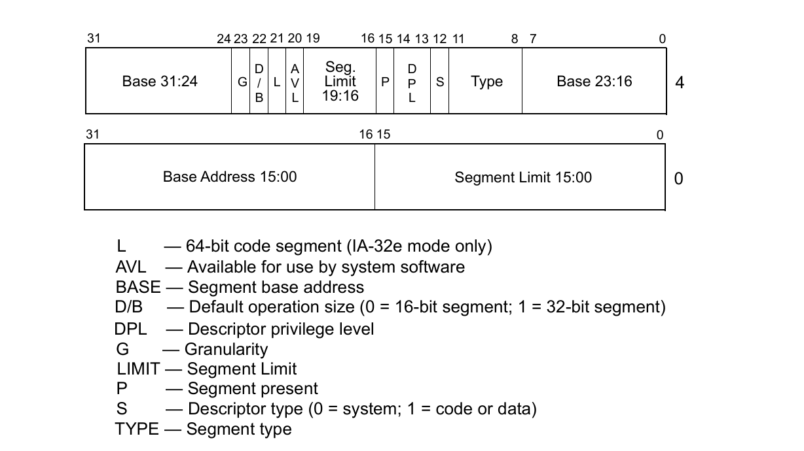

- L 位: 64 位模式使用分页机制，描述符新增了 L 位，需要开启 Long bit 来进入 64-bit 模式

- Base: 基地址 (80286: 24 位, 80386 及以后: 32 位)

- Limit: 段长度

- G 位: 粒度位，设置为 1 时，Limit 的长度 1 bit 代表 4 KiB, 这样 4 KiB * 2^20 = 2^32 可以访问 32 位全部的内存

- D / B 位: 代码段对应 D, 数据段对应 B, 表示默认操作数和有效地址长度
- P 位: 描述符是否有效
- DPL 位 (2 bit):

    - 权限级别分为: Ring 0, Ring 1, Ring 2, Ring 3, 数字越小级别越高
    - 不得越权访问，提升权限需要通过门描述符 (Gate Descriptor)

- S 位: 是否为系统描述符
- Type 字段:
    - 对于非系统描述符，表示代码 / 堆栈 / 数据，以及读写权限:

        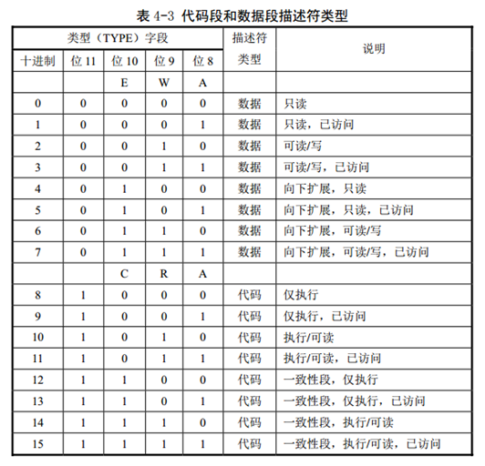

        - E 位: 扩展方向
            - E = 0: 向上扩展，offset 范围 0 - limit
            - E = 1: 向下扩展，offset 范围 limit - 0xFFFFFFFF (用于堆栈段)
        - W 位: 数据段是否可写
        - C 位: 一致性代码段
            - C = 0: 非一致性，只能被同特权级别代码段调用，或者通过门描述符调用
            - C = 1: 一致性，低特权级别程序可以使用，但权限保持原级别
            - 具体机制详见下面 DPL, RPL, CPL 的描述
        - A 位: 是否访问过
    - 对于系统描述符，有如下几种:
        - 1100: Call Gate
        - 0101: Task Gate
        - D110: Interrupt Gate
        - D111: Trap Gate (D 指示门描述符大小 1 = 32 位, 0 = 16 位)

**选择值的结构:**

选择值 (CS / DS / SS 存的 16-bit):

1. 第 15-3 位 (13-bit, 8 KiB 个描述符): Descriptor index
2. 第 2 位: TI, 表示描述符索引在 GDT (全局描述符) 还是 LDT (局部描述符)
3. 第 1-0 位: RPL 选择值自身的权限 Ring 0 - Ring 3

安全级别的设置:

1. DPL: 描述符权限级别
2. RPL: 请求的权限级别，放在 DS 寄存器的低 2 位
3. CPL: CPU 自身的权限级别，放在 CS 寄存器的低 2 位

RPL 和 CPL，通过门描述符越级执行高权限的代码时，请求的内存地址还是原来的权限级别

- 数据需要 MAX(RPL, CPL) <= DPL
- 堆栈需要 CPL = RPL = DPL

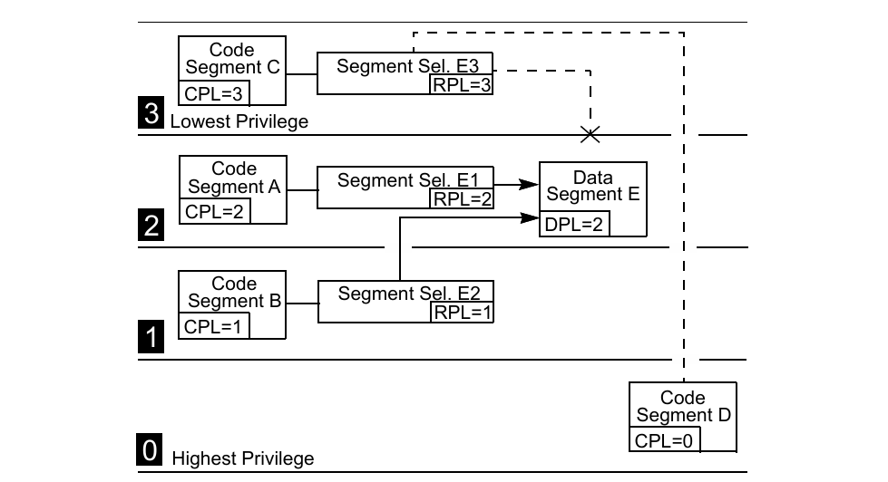

描述符表的基地址由专门的寄存器存储: GDTR 全局描述符寄存器, LDTR 局部描述符寄存器, IDTR 中断描述符寄存器

#### 寻址方式

**分段机制**:

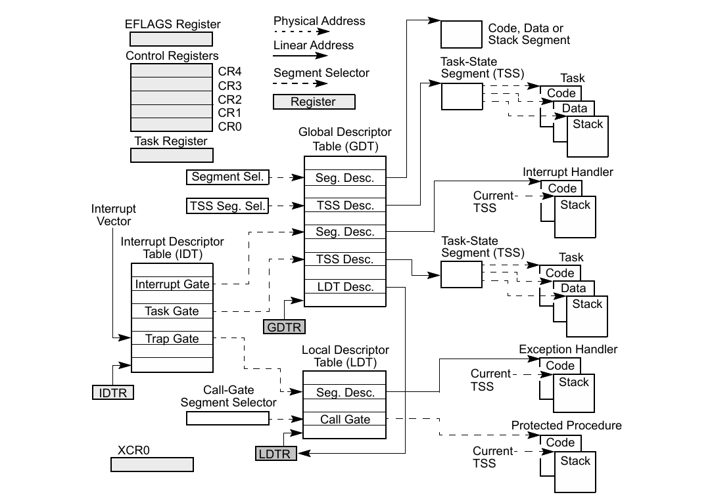

**分页机制**:

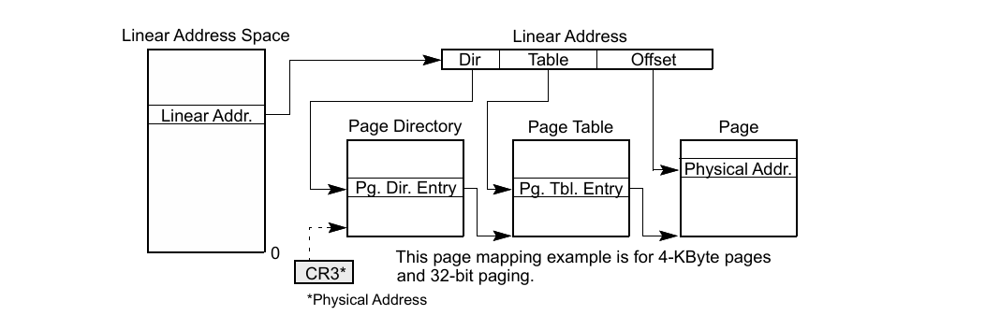

#### 相关计算

1. 计算段界限

    计算方法:

    - G = 0 limit 1 bit = 1 B, 段大小 = (limit + 1) B

    - G = 1 limit 1 bit = 4 KiB, 段大小 = (limit + 1) x 4 KiB

    !!! note "例题"

        计算下面的段起始地址和结束地址: Base: 1000 0000, limit: 001FF

        - G = 0, 1000 0000 - 1000 01FF

        - G = 1, 1000 0000 - 101F FFFF (结束位置 = 起始位置 + 段长度 - 1)
        
        Tips: G = 1 时，左移 3 个十六进制位，补FFF

2. 中断向量与入口地址计算

    计算方法:

    - 根据 IDTR 找到中断描述符表:

    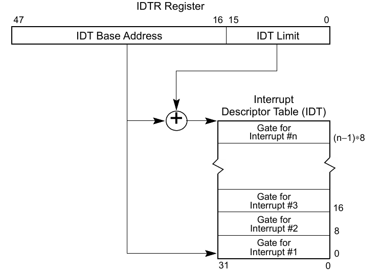

    - 根据中断向量号找到对应的描述符:

    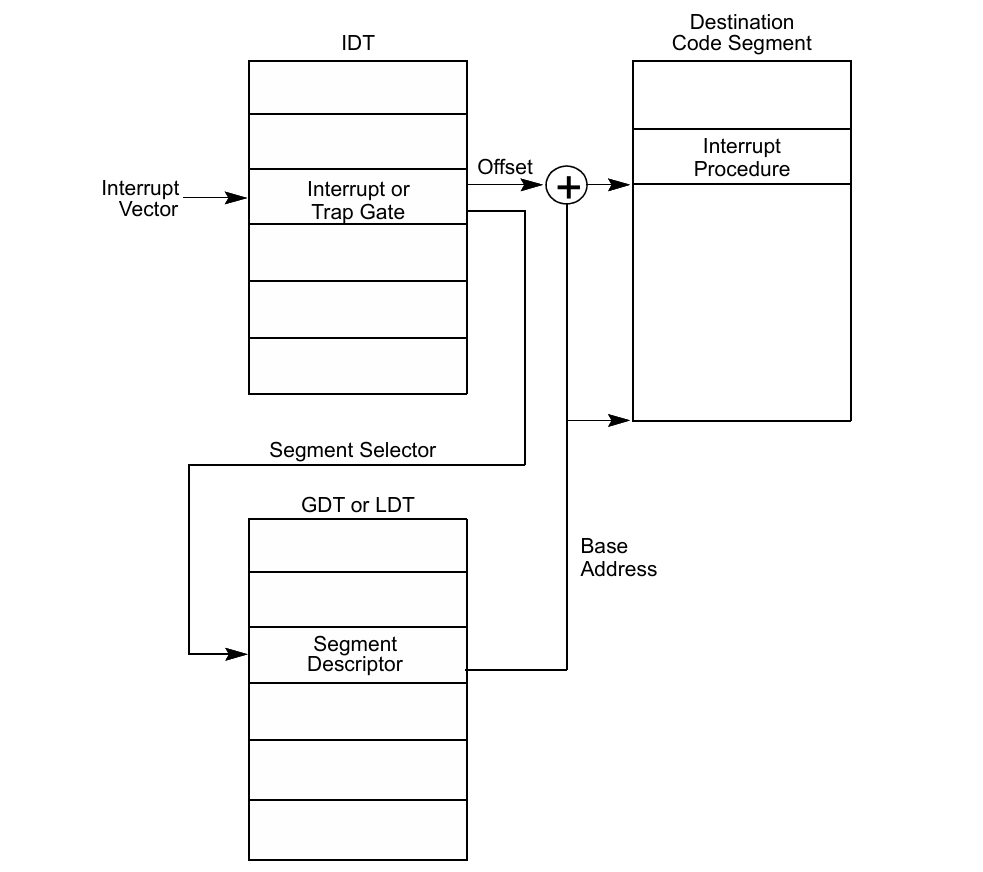

    该中断描述符会包含一个段选择值和偏移量，然后再走一遍分段机制，找到中断服务程序

保护模式的异常和中断:

| 中断向量号 | 助记符  | 介绍                           | 类型         | 原因                                                         |
|:---:|:---:|:------:|:---:|:---:|
| 0          | #DE     | Divide Error                  | Fault        | DIV 和 IDIV 指令                                             |
| 1          | #DB     | Debug Exception               | Fault/Trap   | 指令、数据和 I/O 断点；单步执行等                            |
| 2          | —       | NMI Interrupt                | Interrupt    | 不可屏蔽的外部中断                                           |
| 3          | #BP     | Breakpoint                   | Trap         | INT3 指令                                                    |
| 4          | #OF     | Overflow                     | Trap         | INTO 指令                                                    |
| 5          | #BR     | BOUND Range Exceeded         | Fault        | BOUND 指令                                                   |
| 6          | #UD     | Invalid Opcode (Undefined Opcode) | Fault   | 无效指令或保留指令                                           |
| 7          | #NM     | Device Not Available (No Math Coprocessor) | Fault | 浮点指令或 WAIT/FWAIT 指令                                    |
| 8          | #DF     | Double Fault                 | Abort        | 任何会触发异常、NMI 或 INTR 的指令                           |
| 9          | —       | Coprocessor Segment Overrun (reserved) | Fault  | 浮点指令                                                    |
| 10         | #TS     | Invalid TSS                  | Fault        | 任务切换或访问 TSS                                           |
| 11         | #NP     | Segment Not Present          | Fault        | 加载段寄存器或访问系统段                                     |
| 12         | #SS     | Stack-Segment Fault          | Fault        | 堆栈操作或加载 SS 寄存器                                     |
| 13         | #GP     | General Protection           | Fault        | 任何内存引用和其他保护检查                                   |
| 14         | #PF     | Page Fault                   | Fault        | 任何内存引用                                                |
| 15         | —       | Intel reserved. Do not use.               | —         | —                                                                                         |
| 16         | #MF     | x87 FPU Floating-Point Error (Math Fault) | Fault     | x87 FPU 浮点指令或 WAIT/FWAIT 指令                                                        |
| 17         | #AC     | Alignment Check                           | Fault     | 任何内存数据引用                                                                          |
| 18         | #MC     | Machine Check                             | Abort     | 错误代码（如果有）及来源取决于具体型号                                                   |
| 19         | #XM     | SIMD Floating-Point Exception             | Fault     | SSE/SSE2/SSE3 浮点指令                                                                    |
| 20         | #VE     | Virtualization Exception                  | Fault     | EPT 违规                                                                                  |
| 21         | #CP     | Control Protection Exception              | Fault     | RET、IRET、RSTORSSP 和 SETSSBSY 指令可能触发此异常，或由于缺少 ENDBRANCH 指令导致的异常跳转 |
| 22-31      | —       | Intel reserved. Do not use.               | —         | —                                                                                         |
| 32-255     | —       | User Defined (Non-reserved) Interrupts    | Interrupt | 外部中断或 INT n 指令                                                                      |

#### 特权级别

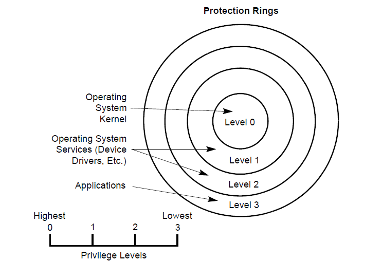

门描述符: 门描述符是一种特殊的描述符，用于实现特权级别的转换。门描述符有两种: 任务门 (Task Gate) 和中断门 (Interrupt Gate)。

### 64 位模式

#### RIP 相对寻址

在 64 位模式下，当 ModR/M 位的 r/m 为 101 时，是根据下一条指令的 RIP + 相对偏移量来寻址 (兼容模式时时相对于 0 计算的). 此时 REX 前缀不影响 RIP 相对寻址.

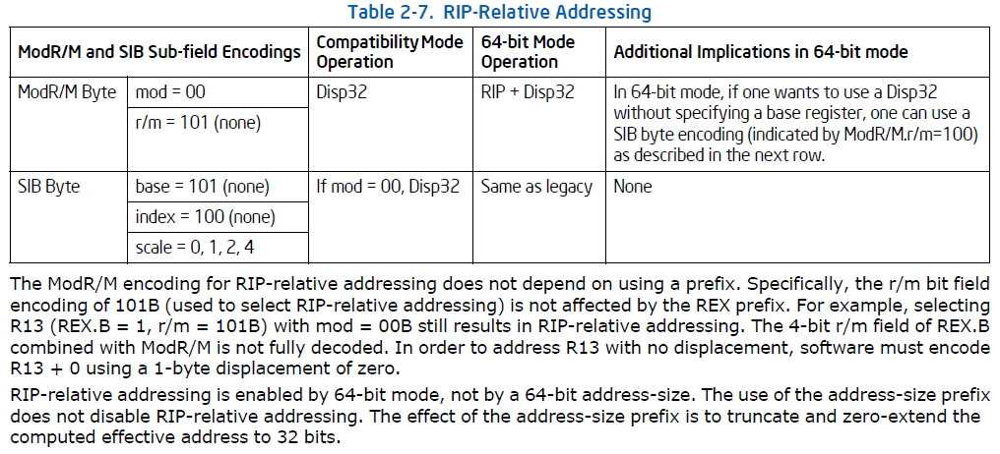

#### 地址规范形式

64 位模式下，地址为规范形式 (canonical form) 意味着从第 63 位到地址的 MSB 之前，必须是全 0 或全 1.

比如对于 48 位线性地址 `addr`，`addr[63:48]` 为全 0 或全 1:

- 规范形式: 0xFFFF 8010 BC00 1000, 0x0000 7C80 B810 2040
- 非规范形式: 0x1122 3344 5566 7788

## 系统运行模式切换

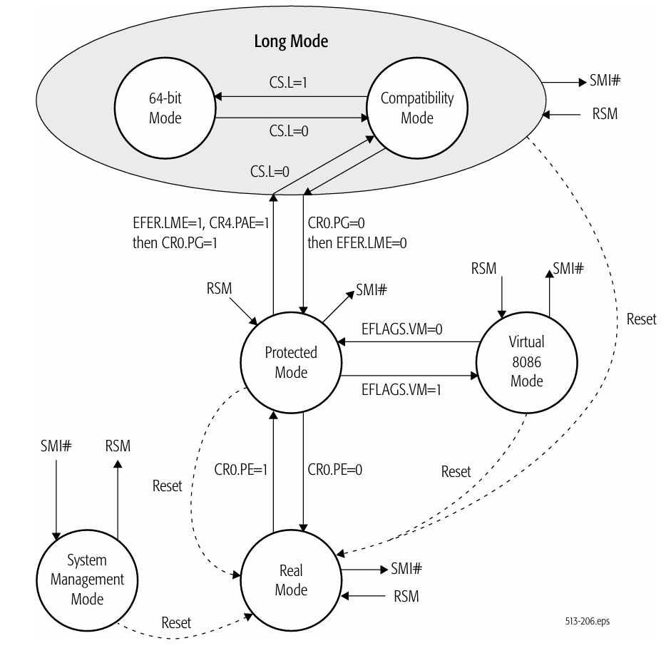

## 内存地址类型及转换

## 内存分页机制

### 32 位分页: 10-10-12

### 32 位 PAE 分页: 2-9-9-12