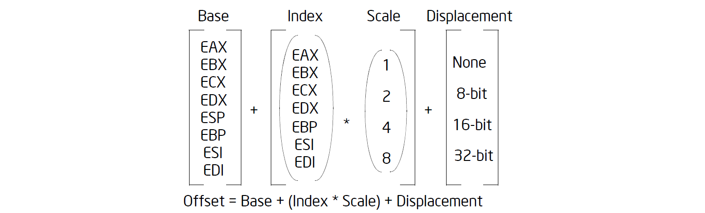

# 寻址方式

## 寻址方式

!!! question "例题"

    Which of the addressing mode in the following instruction is invalid?

    A. mov eax, [esp + 2]

    B. mov eax, [ebx + esp + 2]

    C. mov eax, [esp + 2 * ebx + 2]

    D. mov eax, [2 * esp + ebx + 2]

    ???- success "答案"
        D: 因为 esp 不能作为 index 寄存器, 只能作为 base 寄存器

        对于 B 选项, 汇编器可以自动选择 esp 为 base, ebp 为 index 寄存器

## 小端序