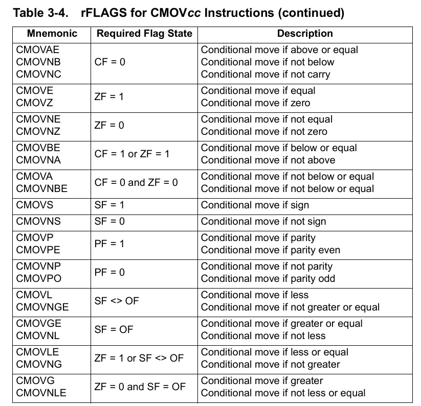
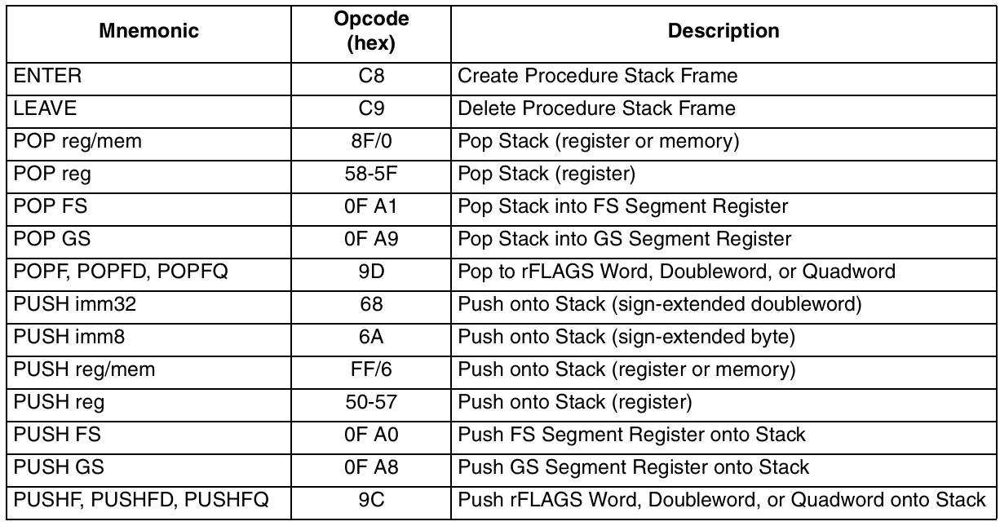

# x86 汇编指令

???+ danger "重点"
    主要考察指令: `mov`, `lea`, `xchg`, `xlat`, `in`, `out`, `cmovcc`, `add`, `sub`, `and`, `or`, `xor`, `neg`, `sar`, `shr`, `test`, `cmp`, `jcc`, `enter`, `int`

    需要重点记忆和理解的内容:

    - 指令操作数 (可能有隐藏操作数)
    - 指令所影响的标志位

## 常见 x86 指令

### 数据传送指令

!!! tip "注意"
    所有数据传送指令**不改变 flags**

1. mov

    - 功能: 寄存器与寄存器、寄存器与内存、内存与寄存器之间的数据传送
    - 操作数: 操作数宽度必须相同，可以是 byte, word, doubleword 和 quadword.

    细节:

    - `mov` 指令不能改变 `cs`, 代码段寄存器只能由控制指令改变
    - `mov` 指令赋值 `ds, es, fs, gs, ss`: 实模式下, 源操作数需为寄存器 (8086 电路层面限制, 从 die shot 上可以看到这些寄存器与通用寄存器在不同的位置), 保护模式下，源操作数必须是合法的段选择值
    - `mov` 指令赋值栈段寄存器 `ss` 时, 下一条语句会不被打断地执行，即使开启单步调试. 这是因为 `ss` 的赋值常常与 `sp / esp` 的指令配合，用来切换栈，这个过程被打断会导致栈乱掉.
    - 64 位模式下, `mov` 默认的操作数宽度为 32 位，需使用 REX.W 指定 64 位操作数，REX.R 辅助编码 r[8-15], 此时无法编码 ah, bh, ch, dh 寄存器.

    变种: movsx, movzx

    `movsx` 和 `movzx` 支持 源操作数宽度 小于 目的操作数宽度 的情况，使用 `movsx` 会对源操作数进行符号扩展 (**s**igned e**x**tension, 高位填符号位)，`movzx` 则进行零扩展 (**z**ero e**x**tension, 高位填 0).

2. lea

    - 功能: 计算有效地址 (Load Effective Address)
        - 但实际上也能计算简单的 `base + scale * index + disp` 类型的算术运算, 不改变 flags

    - 细节:

    `lea` 指令不会访问内存，只是计算内存地址，因此不会改变内存中的值. 如果说 `mov` 对应 C 语言中的取变量值 (如 `c = a`)，那么 `lea` 对应取地址操作 (`ptr = &a`). 汇编代码和对应操作对比如下:

    ```asm
    mov rax, [rbx + 8 * rcx + 4] ; rax = MEM[rbx + 8 * rcx + 4]
    lea rax, [rbx + 8 * rcx + 4] ; rax = rbx + 8 * rcx + 4
    ```

3. xlat

    - 功能: 查表 (xlat = Translate).
    
    以 `al` 寄存器的值作为索引，从 `bx` 指向的表中取出一个字节，存入 `al` 寄存器, 可以理解为 `mov al, seg:[(e)bx + unsigned al]` (该 `mov` 源操作数不合法, 因此只有 `xlat` 能实现这样操作).
    - 操作数:
        - 隐藏源操作数: `al` 寄存器，作为索引, `bx` 和段寄存器 (默认为 `dx`) 指向索查的表
        - 隐藏目的操作数: `al` 存储结果
    
    例子: 7 段数码管显示

    ```asm
    TABLE DB 3FH, 06H, 5BH, 4FH  ; LED status lookup table
          DB 66H, 6DH, 7DH, 27H
          DB 7FH, 6FH
    LOOK: MOV AL, 5              ; load AL with 5 (AL is a BCD number)
          MOV BX, OFFSET TABLE   ; address lookup table
          XLAT                   ; convert
    ```

    细节:

    - 使用 `REX` 前缀时, 查表地址变为 `[rbx + unsigned AL]`, 不再使用 `ds` 寄存器.

4. xchg

    - 功能: **原子**交换两个操作数的值
    - 操作数: 两个操作数必须是寄存器或者内存地址, 宽度必须相同.

    用处:

    - 实现 semaphore, spinlock 等同步机制, 对于操作系统来说尤为重要.

    例子: Spinlock

    

    细节:

    - `nop` 指令实际是 `xchg (e)ax, (e)ax` ，编码为 `90h`. 
    - 操作数涉及内存时，会锁住总线确保一致性和原子性，即使没有 `lock` 前缀.

5. in, out

    - 功能: 与 I/O 端口进行数据传送
    - 操作数: 两个操作数，一个是 I/O 端口号，一个是数据寄存器
        - I/O 端口号: 可以是 8 位立即数，也可以是 `dx` 寄存器 (此时可寻址 16 位的端口号)
        - 数据寄存器: `al`, `ax`, `eax` 中的一个

    例子: 控制蜂鸣器 (仅 DOS 模式)

    ```asm
    .MODEL TINY
    .CODE
    .STARTUP
        IN AL, 61H    ; speaker
        OR AL, 3
        OUT 61H, AL   ; speaker on
        MOV CX, 8000H ; delay count
    L1:
        LOOP L1
        IN AL, 61H
        AND AL, 0FCH  ; speaker off
        OUT 61H, AL
    .EXIT
    ```

    ???+ tip "注意"
        这两条指令在接口部分的课程中会经常见到，考试一定会考到其使用方法，请务必学会.

**条件数据传送指令 cmov 系列**

`cmov` 系列指令根据标志位的状态来决定是否执行数据传送操作，将原本需要分支语句的功能转化为一条指令，更适合现代处理器的流水线执行

```asm
; with cmov
cmovz eax, ebx    ; if ZF = 1, eax <- ebx

; equivalent to
test eax, eax
jnz .label        ; if ZF != 1, skip
mov eax, ebx      ; eax <- ebx
.label:
```




### 算数指令

1. add, sub

2. sar, shr


### 逻辑指令

1. and, or, xor

2. neg

3. test

4. cmp

### 控制指令

1. jmp

    - 近跳转: push eip, jmp offset
    - 远跳转: push cs, push eip, jmp offset

2. jcc

    `jcc` 是一系列条件跳转指令的统称，意思是 *Jump if Condition Is Met*. 下表只展示了其中一部分的指令:

    

    细节:

    - 有符号比较与无符号比较的跳转指令:
        - 无符号比较: `ja, jae, jb, jbe, je, jne` (Above, Below)
        - 有符号比较: `jg, jge, jl, jle, je, jne` (Greater, Less)
    - `jcxz / jecxz / jrcxz` 指令虽然不属于 `jcc` (不检查状态位), 但也值得一提: 当 `cx / ecx / rcx` 为 0 时跳转, 常常将 `cx` 作为循环次数, 该指令用于循环结束判断.
    - `jcc` 指令不支持远跳转 (far jump).

3. enter, leave

    !!! danger "注意"
        `enter` 和 `leave` 指令在实践中性能很差，而且不是所有编程语言需要嵌套的栈帧.
        
        现代编译器并不会生成这两条指令，也不建议手动使用.

    - 功能: 为函数创建栈帧，分配动态存储空间，并根据嵌套级别保存上一层栈帧指针, 一般与 `leave` 指令搭配使用
    - 操作数:
        - 第一个操作数指定动态存储空间的大小
        - 第二个操作数确定嵌套级别 (0-31)
        - 嵌套级别决定从前一栈帧复制指针的数量和存储指针的空间大小
    
    例子:

    1. 如果不使用嵌套栈帧功能, 可以使用 `enter 0, 0` 代替 `push ebp; mov ebp, esp` 的操作, 比如:

    ```asm
    enter 16, 0 ; 16 bytes of local storage, no nesting
    ; ...
    leave       ; deallocate local storage and restore previous frame pointer

    ; equivalent to
    push ebp      ; save old base pointer
    mov ebp, esp  ; set base pointer to current stack
    sub esp, 16   ; allocate 12 bytes for this stack frame
    ; ...
    add esp, 16   ; deallocate local storage
    pop ebp       ; restore base pointer
    ```


    2. 嵌套栈帧功能, 相当于在构造栈帧时，将父函数的 `ebp` 也保存到当前栈帧中, 使得子函数可以通过这些父级 `ebp` 引用到父级栈帧的局部变量.

    ```asm
    enter 16, 3    ; 16 bytes of local storage, nesting level 3

    ; equivalent to
    push ebp
    mov eax, esp   ; eax = temporary frame pointer

    .LOOP          ; assume cx = 3
        sub ebp, 4 ; assume 32-bit mode
        push dword ptr [ebp]
    .UNTILCXZ
    push eax      

    mov ebp, eax
    sub esp, 16
    ```

    

4. int

    - 功能: 产生中断
    - 操作数: 中断号
        - CPU 随后根据中断号查找中断向量表, 跳转到对应的中断处理程序

    例子: DOS 的 `int 21h` 用于退出程序

    ```asm
    mov ax, 4ch ; al = 4ch, ah = 0 for return code
    int 21h
    ```

    细节:

    - `int` 指令会将当前的 `CS` 和 `EIP` 压入栈中，然后跳转到中断处理程序
    - 中断处理程序的入口地址存放在中断向量表中，中断号乘以 4 为中断处理程序的地址
    - 中断处理程序执行完毕后，使用 `iret` 指令返回，`iret` 会弹出栈中的 `CS` 和 `EIP`
    - 所有中断处理程序有责任保存和恢复所有使用过的寄存器，包括标志寄存器，以恢复现场

## 中断 / 异常

## 伪指令

课程主要介绍 masm 的伪指令 (Directive)

### 控制流伪指令

1. 伪指令

    - `.WHILE`, .`ENDW`

    - `.REPEAT`, `.UNTIL`, `.UNTILCXZ`

    - `.IF`, `.ELSE`, `.ELSEIF`, `.ENDIF`

    - `.BREAK`, `.CONTINUE`

2. 运算

    - `!`, `!!`, `&&`, `||`, `==`, `!=`, `>`, `<`, `>=`, `<=`: 逻辑运算, 与 C 语言类似
    - `CARRY?`, `PARITY?`, `SIGN?`, `ZERO?`, `OVERFLOW?`: 用于判断状态位

### 函数定义伪指令

- `PROC`, `ENDP`: 定义函数
- `NEAR`, `FAR`: 函数调用方式, 其 `ret` 时跳转方式 Opcode 不同，一个是近跳返回，一个是远跳返回


- `USE`: 声明函数所使用的寄存器, 汇编器会自动保护这些寄存器

## 指令编码


### REX 前缀

#### 功能


- W 位: 指示操作数大小, W = 1 代表 64 位操作数，W = 0 时根据 CS 选择符的 D 位确定
- R 位: 扩展 ModR/M 字段的 reg
- X 位: 扩展 SIB 字段的 Index
- B 位: 扩展 ModR/M 字段的 r/m, SIB 的 base 或者 Opcode 编码的 reg


#### 使用场景

需要 REX 前缀的情况:

- 使用 r[8-15] 及其部分寄存器的指令
- 使用 spl, bpl, sil, dil 寄存器 (sp, bp, si, di 的低八位) 的指令
- 使用 64 位操作数的指令

不需要 REX 前缀的情况:

在 64 位模式下，下面两种指令默认使用 64 位操作数，无需 REX 前缀:

- 近跳转: Near Jump 指令
- 除远跳转之外的所有用到 rsp 的指令，见下表:



#### 杂项

1. REX 前缀占据了 40H - 4FH 的 Opcode 空间，因此在 64 位模式下，原有的一些单字节 Opcode (如 inc, dec) 会被覆盖，需要用该指令的 ModR/M 形式.

3. 64 位模式下若使用 REX 前缀, mov 无法编码 ah, bh, ch, dh 寄存器