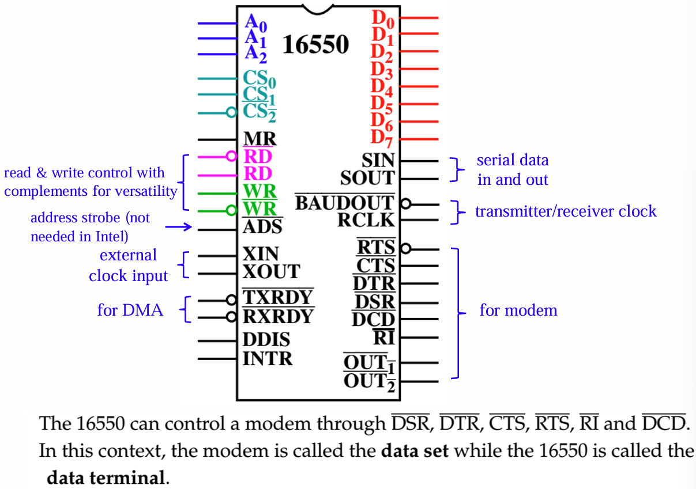
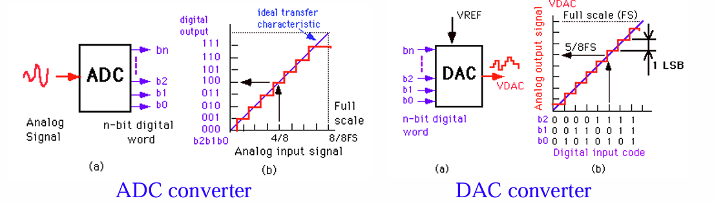

# 接口

!!! tips "考试范围"
    本部分会考察简单的接口编程方法，因此需要对各接口芯片的端口及其功能有一定的了解。最后一颗数模转换芯片不考察编程，只需了解一些技术指标的计算。

    这一部分最理想的学习方式是读手册，所以我会给每个接口附上其对应的手册。

## 8086 微处理器

手册: [Intel 8086/8088 微处理器手册](https://edge.edx.org/c4x/BITSPilani/EEE231/asset/8086_family_Users_Manual_1_.pdf), 一个简化的 [Cheat Sheet](https://jishanshaikh4.github.io/8086-cheatsheet/main.pdf).

### 引脚描述


8086 的数据总线为 16 位，地址总线为 20 位，对应引脚如下:

- AD0 - AD15: 地址与数据总线 (共用部分)
- A16 - A19: 地址总线剩余的部分

其他引脚功能:

- CLK: 时钟信号
- INTR: 中断请求线
- $\overline{\text{BHE}}$: 总线高字节使能 (Bus High Enable), 指示总线高八位数据有效

### 工作模式

Maximum Mode 最大模式: 最大模式适用于系统存在多个微处理器的情况，8086 作为主处理器，而其他处理器作为协助处理器，比如 8087 浮点数协处理器可以为 8086 提供浮点运算功能。此时，8086 的通信都是请求式的，需要等待 8288 总线芯片的仲裁信号，控制信号由总线控制器 8288 产生。

Minimum Mode 最小模式: 最小模式适用于系统中只有 8086 一个微处理器的情况，此时 8086 可以直接发送控制信号，并对内存和外部设备有完全的管理权限。

### 内存组织方式

8086 和 8088 的 bank 以 1 Byte 为宽度来组织内存。8088 的数据总线是 8 位，因此只需要一个 bank 来管理，无需 $\overline{\text{BHE}}$ 信号。然而，8086 的数据总线是 16 位，内存需要分为奇偶两个 bank，并通过 $\overline{\text{BHE}}$ 信号来指示高 8 位 (奇 bank) 是否有效。


使用数据线的不同情况:

- 单字节 & 偶地址: $D_7-D_0$

- 单字节 & 奇地址 $D_{15}-D_8$ 

- 双字节 & 偶地址: $D_{15}-D_0$

- 双字节 & 奇地址: 此时内存未对齐，访问需要多一个周期。先读 $D_{15}-D_8$，再读 $D_7-D_0$

## 82C55 可编程并行接口

Intersil 提供的 [82C55A 手册](https://www.renesas.com/en/document/dst/82c55a-datasheet?srsltid=AfmBOoq6LvEYsaDWUQyikJ0R95ZRy_F4KISrj8jmVVgUL2wjkqgImil9)

### 器件构成

82C55 是一个 24 引脚的可编程并行接口，包含 3 个 8 位 I/O 端口，分别为 A, B, C。

这三个端口分为两组:

- Group A 由 A 端口和 C 的高 4 位 ($\text{PC}_7-\text{PC}_4$) 构成，可以工作在模式 0, 1, 2
- Group B 由 B 端口和 C 的低 4 位 ($\text{PC}_3-\text{PC}_0$) 构成，可以工作在模式 0, 1

82C55 的引脚描述如下:


- $\overline{\text{CS}}$: 芯片选择信号，低电平有效
- $\overline{\text{RD}}$: 读信号，低电平有效，表示读取数据或工作状态
- $\overline{\text{WR}}$: 写信号，低电平有效，表示写入数据或控制字
- $\text{A}_1-\text{A}_0$: 端口地址线，用于选择 Port A, Port B, Port C
- $\text{D}_7-\text{D}_0$: 数据总线
- $\text{PA}_7-\text{PA}_0$: Group A 的 8 位端口
- $\text{PB}_7-\text{PB}_0$: Group B 的 8 位端口
- $\text{PC}_7-\text{PC}_0$: Group C 的 8 位端口

端口 A 比端口 B 功能多的原因在于，在 82C55 内部，端口 A 由独占的输入 latch 和输出 latch / buffer, 而端口 B 只有输入 buffer 和共享的输入输出 latch / buffer.

### 控制字设置

82C55 的控制字为 8 位，但是可以控制两个功能，一是设置每个 Group 的工作模式，二是控制 Port C 每个引脚的输入输出方向，这两个控制功能通过最高位 $D_7$ 来区分.

#### 控制字 A - 模式设置

当 $D_7$ 为 1 时，设置的是 Group A 和 Group B 的工作模式和输入输出方向. 注意只有 Group A 可以工作在模式 2, 因此 Group A 的工作模式需要有 2 位来表示.


#### 控制字 B - Port C 设置

当 $D_7$ 为 0 时，设置的是 Port C 的输出电平. $D_0$ 表示的是设置 / 重置 (set / reset), 而 $D_3-D_1$ 表示的是设置的引脚. 注意此时 $D_6-D_4$为 don't care.


### 运行方式

#### 模式 0

模式 0 无握手信号，只有基本的输入输出，适用于简单的 *Always On* 的 I/O 操作。比如点亮 LED 灯，只 CPU 需要输出亮灯状态即可。模式 0 时接口功能如下:

- 两个 8 位端口 Port A, Port B 以及两个 4 位端口: Port C 的高 4 位和低 4 位
- 每个端口均可以独立设置输入和输出
- 输出有 latch 锁存输出状态，输入没有

???+ note "例子: 控制步进电机"

    half-step 半步控制:
    ```asm
    .stack 64h
    .data
    datacw  db 0000_0110b ;
            db 0000_0100b ; half-step
            db 0000_0011b ; 顺时针旋转位置
            db 0000_0010b ;

    .code
        mov ax, @data
        mov ds, ax
        mov bx, offset datacw
        mov si, 0         ; 步进位置
        mov cx, 16        ; 步进次数
    next_step:
        mov al, [bx][si]  ; 加载当前状态步进电机控制状态
        out 7, al         ; 输出到端口
        inc si
        cmp si, 4
        jb next_step
        mov si, 0         ; 重置步进位置
        loop next_step
        hlt
    .exit
    ```

    micro-step 微步控制: 用 cx 的最高位表示方向，后面 15 位表示步进多少步

    ```asm
        PORT EQU 40h ; 端口 A 地址

    STEP PROC NEAR USES cx ax
        mov al, pos
        or  cx, cx                   ; 判断当前转子位置
        .IF !ZERO?                   ; 如果转子位置不为 0
            .IF !SIGN?
                .REPEAT
                    rol al, 1        ; 向左旋转
                    out port al
                    call delay       ; 等待 1 ms
                .UNTILCXZ
            .ELSE
                and cx, 7FFFh
                .REPEAT
                    ror al, 1        ; 向右旋转
                    out port, al
                    call delay       ; 等待 1 ms
                .UNTILCXZ
            .ENDIF
        .ENDIF
        mov pos, al
        ret
    STEP ENDP
    ```


#### 模式 1

模式 1 采用选通式握手信号，适用于需要 CPU 和外设之间的数据传输。比如键盘输入，CPU 需要读取键盘的输入。

模式 1 输入的工作时序:

1. 设备通过 $\overline{\text{STB}}$ 信号通知 82C55 数据准备好
2. 82C55 通过 IBF 信号告知设备当前输入缓冲已满，不要再传数据
3. 83C55 通过 INTR 给 CPU 发送中断，请求 CPU 读取数据
4. CPU 通过 $\overline{\text{RD}}$ 信号读取数据

模式 1 输出的工作时序:

1. CPU 通过 $\overline{\text{WR}}$ 信号写入数据
2. 82C55 通过 $\overline{\text{OBF}_\text{B}}$ 低电平告知设备输入缓冲已满，通知设备读取
3. 设备通过 $\overline{\text{ACK}}$ 通知 82C55 已经读走数据
4. 82C55 向 CPU 发送中断，告知 CPU 可以继续写入数据

???+ note "例子: 控制并口打印机"

    串口打印机每次接受 1 Byte ASCII 码，存储在 ah 寄存器中。

    使用端口 B 进行并行输出，同时控制端口 C 的 $\text{PC}_2$ 作为 $\overline{\text{ACK}}$ 输入引脚，端口 C 的 $\text{PC}_4$ 作为 $\overline{\text{DS}}$ 输出引脚，代表数据选通信号:

    


    ```asm
    BIT1  EQU 2
    PORTC EQU 62H
    PORTB EQU 61H
    CMD   EQU 63H

    PRINT PROC NEAR
        .REPEAT
            in   al, portc ; 读取 82C55 状态字
            test al, BIT1  ; 检测 OBF 标志位
        .UNTIL !ZERO?      ; 等待直到 OBF = 1，即输出缓冲区满
        mov al, ah         ; 待打印字符位于 ah
        out PORTB, al      ; 发送数据
        mov al, 8          ; 0000_1000, bit reset, 选择 (100)_2 = 4
        out CMD, al        ; 重置 PC4 为 0: 选通信号置 0
        mov al, 9          ; 0000_1001, bit set,   选择 (100)_2 = 4
        out CMD, al        ; 设置 PC4 为 1: 选通信号置 1
        RET
    PRINT ENDP
    ```

    TODO: 这里使用 PC4 的原因

#### 模式 2

模式 2 则包含了双向总线操作，可以在不同时间做输入和输出，而模式 0 和 1 的输入输出方向是固定的。

```asm
BIT5  EQU 20h
PORTA EQU 62h
PORTC EQU 60h

READ PROC NEAR
    .REPEAT
        in   al, PORTC  ; 读入状态
        test al, BIT5   ; 检查 IBF 标志位
    .UNTIL !ZERO?       ; 一直等待，直到 IBF = 1，即输入缓冲区满
    in al, PORTA        ; 从数据端口读取
    ret
READ ENDP
```


## 8254 可编程定时器

手册: [8254 可编程定时器手册](https://www.scs.stanford.edu/23wi-cs212/pintos/specs/8254.pdf)

### 器件构成

8254 是一个可编程定时器，其内部含有 3 个独立的计数器，每个计数器都是 16 位的，可以工作在不同的工作模式下。不过，8254 的数据总线只有 8 位，因此需要两次读写操作才能完成对 16 位计数器的操作。8254 芯片的内部结构与引脚描述如下:


- $\overline{\text{CS}}$: 芯片选择信号, 低电平有效
- $\text{A}_1-\text{A}_0$: 端口选择，指定要操作的计数器
    - 当 $\text{A}_1-\text{A}_0 = 11$ 时，表示读写控制字
- $\overline{\text{RD}}$: 读信号, 低电平有效
- $\overline{\text{WR}}$: 写信号, 低电平有效
- $\text{D}_7-\text{D}_0$: 数据总线
- $\text{CLK}$, $\text{GATE}$, $\text{OUT}$: 时钟输入, 门控输入, 输出信号

### 编程方式

8254 单个计数器的内部结构如下 (控制字寄存器是共用的):


计数器寄存器是 16 位的 CE，其输入是两个 8 位的寄存器初值寄存器 $\text{CR}_\text{M}$ 和 $\text{CR}_\text{L}$，其输出又接入了两个 8 位的输出锁存器 $\text{OL}_\text{M}$ 和 $\text{OL}_\text{L}$. 这样一来，读计数器的值和写入计数初值的操作都不影响计数器的工作 (不过仍然建议使用门控信号暂停计数再操作).

#### 控制字格式

8254 控制字的格式如下:


- $\text{SC}_1-\text{SC}_0$: 选择计数器 (Select Counter)
    - 当 $\text{SC}_1-\text{SC}_0 = 11$ 时, 表示回读计数器状态
- $\text{RW}_1-\text{RW}_0$: 读写计数器的方式, 00 表示计数器锁存
- $\text{M}_2-\text{M}_0$: 工作模式，模式 0-5
    - 000: 模式 0
    - 001: 模式 1
    - X10: 模式 2
    - X11: 模式 3
    - 100: 模式 4
    - 101: 模式 5
- $\text{BCD}$: 二进制或 BCD 计数方式, 二进制计数范围 0 - 0xFFFF (65535), BCD 计数范围 0 - 9999

#### 两阶段初始化

#### 读计数器方式

**读取计数器的值**: 使用计数器锁存指令


```asm
    mov  al, 10000000b ; 10_00_0000: 计数器 2 锁存
    out  43h, al
    in   al, 42h       ; 读取 LSB
    mov  ah, al
    in   al, 42h       ; 读取 MSB
    xchg ah, al        ; 交换 ax 的高低字节
```

**读取计数器状态**: 使用控制字回读指令，当 $\text{D}_7-\text{D}_6 = 11$ 时，表示回读计数器状态，此时其他位有不同的含义:


一些回读指令的例子:


注意，如果已经锁存了 计数 / 状态，如果没有读走，再次发送锁存指令不会更新锁存的值. 如果计数和状态都锁存了，那么一定先读取状态，再读取计数 (因为计数值可能单字节，也可能双字节，读取与写入设置相同).

状态字含义: ($\text{D}_5-\text{D}_0$ 与控制字格式相同)


```asm
    mov  al, 11000010b ; 11_00_001_0: 回读指令, 锁存计数和状态, 计数器 0
    out  43h, al
    in   al, 40h       ; 读取计数器 0 状态字
    mov  bl, al        ; 状态字保存至 bl
    in   al, 40h       ; 读取计数器 LSB (假设计数器 0 读写双字节)
    mov  ah, al
    in   al, 40h       ; 读取计数器 MSB
    xchg ah, al        ; 交换 ax 的高低字节
```


### 运行模式

下面用到的一些术语:

- CLK Pulse (CLK 脉冲): 时钟信号 CLK 的一个上升沿 + 一个下降沿，直到下降沿才算一个脉冲.
- Trigger (门控触发): 门控信号 GATE 的上升沿.

#### 模式 0: Interrupt on Terminal Count 计数定时中断

模式 0 适合将 $\text{OUT}$ 与中断控制器相连，用于产生定时中断.

写入控制字后，门控有效开始计时，$\text{OUT}$ 始终为低电平，直到计数器变为 0，$\text{OUT}$ 变为高电平并维持.

特点: 计数初值在 CLK 脉冲**下降沿**加载，直到初值完全加载后才开始计数. 无论是单字节还是双字节初值 N，都只在完全加载后才开始计数. 单字节 N+1 个 CLK 脉冲，双字节 N+2 个 CLK 脉冲.

??? note "时序图"

    Case 1: 正常工作情况. 计数初值在 CLK 脉冲下降沿加载，计数器变为 0 时, OUT 拉高并保持. 计数到 0 继续减 1 会变成 0xFFFF.

    

    Case 2: 门控信号 GATE 拉低，计时暂停.

    

    Case 3: 重新载入计数初值情况.

    

#### 模式 1: Hardware Retriggerable One-shot 硬件可重触发单脉冲

$\text{OUT}$ 最开始是高电平，当检测到一个 CLK 脉冲和门控触发时，$\text{OUT}$ 变为低电平，直到计数器变为 0 后，拉高并仅维持. 直到下一次门控触发跟一个 CLK 脉冲，重新开始计数.

计数初值加载 (armed) 后，门控触发 (trigger) 会在下一个 CLK 脉冲下降沿立刻加载计数器，将 $\text{OUT}$ 拉低，开始单脉冲计数. 在计数期间写入计数初值不影响当前计数，除非又来了一次触发信号.

??? note "时序图"

    Case 1: 正常工作情况. 时钟在门控触发 + CLK 脉冲的下降沿载入，每次 CLK 脉冲计数一次.

    

    Case 2: 多次触发情况. 可以看到计数器在门控触发 + CLK 脉冲的下降沿重新加载.

    

    Case 3: 重新写入初值情况. 重新写入初值不会影响当前计数，直到下一次触发.

    

#### 模式 2: Rate Generator: 时钟分频

模式 2 适用于时钟分频，当计数初值为 N 时，输出频率被分频为 $\frac{1}{N}$.

$\text{OUT}$ 绝大多数情况为高电平，直到当计数器减小到 1 时，变为低电平，且只维持一个 CLK 脉冲. 随后计数器重新加载初值，继续计数，循环下去. 

门控信号会影响模式 2 的输出. 当门控信号 = 0 (无效) 时，$\text{OUT}$ 立刻拉高，直到下一次门控有效，重新装入初始值并开始计数.

??? note "时序图"

    Case 1: 正常工作情况. 可以看到 $\text{OUT}$ 每 N = 3 个周期拉低一次.

    

    Case 2: 门控信号影响情况. 当门控信号 = 0 (无效) 时，$\text{OUT}$ 立刻拉高，直到下一次门控有效，重新装入初始值并开始计数.

    

    Case 3: 重新载入计数初值情况. 重新写入初值不会影响当前计数，直到下一次计数.

    

#### 模式 3: Square Wave Mode: 方波

模式 3 适用于产生方波信号，$\text{OUT}$ 会在计数器的一半时拉高，另一半时拉低.

如果输入 N 为偶数，那么占空比为 50%, 如果 N 为奇数，高电平周期比低电平周期多一个，占空比为 $\frac{N+1}{2N}$.


#### 模式 4: Software Triggered Strobe: 软件触发选通

类比模式 0, 不过模式 4 在计数器到达 0 时只产生 1 拍低电平.

#### 模式 5: Hardware Triggered Strobe (Retriggerable): 硬件触发选通

与模式 4 类似，但是只要门控信号上升沿就触发计数，即使没有被时钟信号上升沿采样到 (因为硬件产生的信号时异步的).

#### 总结

门控信号 $\text{GATE}$ 对不同模式的影响:

| **模式** | **低电平 / 下降沿** | **上升沿**  | **高电平** |
|:------------------------:|:----------------------------------------------------:|:---------------------------------------------:|:-------------------------:|
| **0** | 暂停计数  |  | 启动计数 |
| **1** |  | 1) 载入计数初值 <br>2) 在下一次 CLK 时重置输出 | |
| **2** | 1) 暂停计数<br>2) 立刻拉高输出 | 载入计数初值 | 启动计数 |
| **3** | 1) 暂停计数<br>2) 立刻拉高输出 | 载入计数初值 | 启动计数 |
| **4** | 暂停计数  |  | 启动计数 |
| **5** |  | 载入计数初值 | |

最小和最大计数次数的计数初值设置:

| **模式** | **最小次数** | **最大次数** |
|:--------:|:-------------:|:-------------:|
| **0**    | 1             | 0             |
| **1**    | 1             | 0             |
| **2**    | 2             | 0             |
| **3**    | 2             | 0             |
| **4**    | 1             | 0             |
| **5**    | 1             | 0             |


!!! note "例题: 计数初值计算"

    1. 输入时钟频率为 8 MHz, 需要一个 100 KHz 的方波和 200 KHz 的持续脉冲，该如何设置 8254 的计数初值?

        - 计数器 0: 模式 3, 计数初值为 80 (8 Mhz / 100 Khz = 80)
        - 计数器 1: 模式 2, 计数初值为 40 (8 Mhz / 200 Khz = 40)

    2. 如果要产生 100 Hz 的方波，该如何设置 8254 的计数初值?

        - 8 Mhz / 100 Hz = 80000 > 65535 超过计数初值上限
        - 需要串联分频: 比如先降到 10 KHz 再降到 100 Hz
            - 计数器 0: 模式 2, 计数初值为 800 (8 Mhz / 10 Khz = 800)，输出连接到计数器 1 的 CLK 信号
            - 计数器 1: 模式 3, 计数初值为 100 (10 Khz / 100 Hz = 100)

#### 例程

**例程 1**: 8 MHz 时钟，输出 100 KHz 方波与 200 KHz 持续脉冲

```asm
TIME PROC NEAR USES ax dx
    mov dx, 706h       ; 计数器控制字端口
    mov al, 00110110b  ; 00_11_011_0: 计数器 0 写入双字节, 工作在模式 3
    out dx, al
    mov al, 01110100b  ; 01_11_010_0: 计数器 1 写入双字节, 工作在模式 2
    out dx, al

    mov dx, 700h       ; 计数器 0 端口
    mov al, 80         ; LSB = 80 (分频系数)
    out dx, al
    mov al, 0          ; MSB = 0
    out dx, al

    mov dx, 702h       ; 计数器 1 端口
    mov al, 40         ; LSB = 40 (分频系数)
    out dx, al
    mov al, 0          ; MSB = 0
    out dx, al

    ret
TIME ENDP
```

## 16550 串行通信接口

### 器件构成



- $\text{A}_2-\text{A}_0$: 三根地址线，不过后面利用读写复用，提供了 12 个端口

- CS: 三根片选信号，为了兼容性，实际上只用一个就行，其他的必须 disable (或门)

- RD, WR: 读和写都有两个，也是为了兼容性，另一个必须 enable (与门)

- ADS: 地址锁存信号: 并不是所有的芯片都能保证读写信号有效的情况下，地址仍然有效（比如摩托罗拉的 CPU）, Intel 的芯片没有这个问题，也不需要. 只要给 ADS 接低就可以

- XIN, XOUT: 外部时钟输入

- $\overline{\text{TXRDY}}$, $\overline{\text{RXRDY}}$: 用于 DMA

- INTR: 中断

- SIN, SOUT: 串行数据的进出，全双工

- $\overline{\text{BAUDOUT}}$, RCLK: 两个时钟，一个是发送时钟，一个是接收时钟. 前者是内部产生的，后者可以从外部接过来，也可以接 $\overline{\text{BAUDOUT}}$

- 后面的引脚都是用来接调制解调器的

端口读写复用:


### 两阶段编程

#### 初始化

```asm
LINE EQU 0F3H
LSB  EQU 0F0H
MSB  EQU 0F1H
FIFO EQU 0F2H

INIT PROC NEAR
    mov al, 10001010b
    out LINE, al

    mov al, 120         ; 9600 波特率的分频系数 (查表)
    out LSB, al

    mov al, 0
    out MSB, al

    mov al, 00001010b   ; 7 数据位, 1 停止位, 奇校验
    out LINE, al

    mov al, 00000111b   ; 启用发送和接受
    out FIFO, al

    ret
INIT ENDP
```

#### 收发使能

发送数据:

```asm
LSTAT EQU 0F5H
DATA  EQU 0F0H

SEND PROC NEAR USES AX
    .REPEAT
        in   al, LSTAT
        test al, 20h    ; 检测 TH 标志位 (Transmitter holding)
    .UNTILL !ZERO?

    mov al, ah
    out DATA, al        ; 发送数据
    ret
SEND ENDP
```

接收数据

```asm
LSTAT EQU 0F5H
DATA  EQU 0F0H

REVC PROC NEAR USES AX
    .REPEAT
        in   al, LSTAT
        test al, 1      ; 检测 DR 标志位 (Data Ready)
    .UNTILL !ZERO?

    test al, 0Eh        ; 检测是否发生错误 (FE, PE, OE 非 0)
    .IF ZERO?
        in  al, DATA    ; 读取数据
    .ELSE
        mov al, '?'     ; 用 '?' 代表接受错误
    .ENDIF
    ret
REVC ENDP
```

###通信状态检测

## DAC0830 数模转换芯片

### D/A 转换



### DAC 技术指标

- Resolution / Step size 分辨率: 最小数字量电压变化的值, 对于 $n$ 位的 DAC, 分辨率计算方法为:

\[
\text{Resolution} = \dfrac{V_{\text{REF}}}{2^n} = \dfrac{V_{\text{FS}}}{2^n-1}    
\]

其中 $V_{\text{REF}}$ 为参考电压, $V_{\text{FS}}$ 为满量程输出电压.

- Linearity 线性度

- Settling Time 建立时间: 输出电压稳定到理想电压 $\pm \frac{1}{2}$ 最小数字量电压所需要的时间.

!!! note "例题"

    1. 一个 4 位 DAC 的**满量程输出电压**为 15V, 求输入为 $(0110)_2$ 时其输出电压:

        - 分辨率: $\dfrac{15}{2^4-1} =$ 1V / LSB
        - 输出电压: $6 \times 1 =$ 6 V
    
    2. 一个 4 位 DAC 的**参考电压**为 15V, 求输入为 $(0110)_2$ 时其输出电压:

        - 分辨率: $\dfrac{15}{2^4} =$ $\dfrac{15}{16}$ V / LSB
        - 输出电压: $6 \times \dfrac{15}{16} =$ 5.625 V