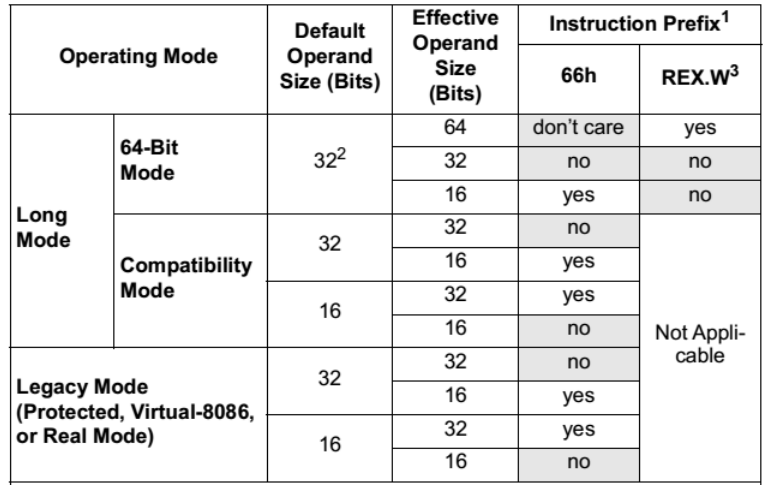
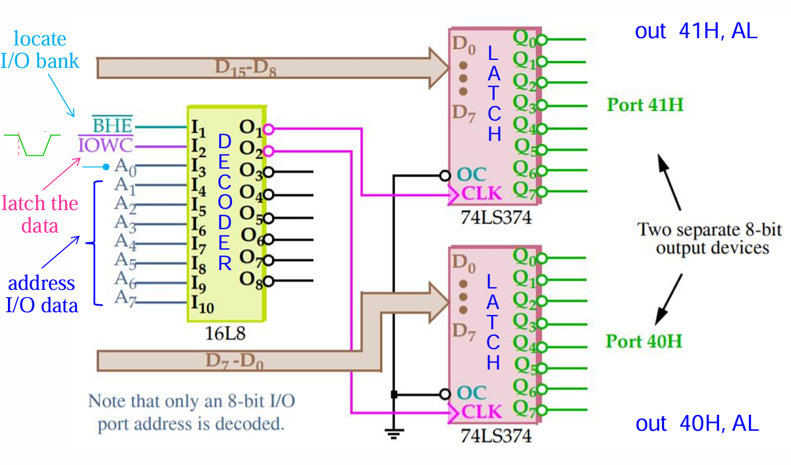
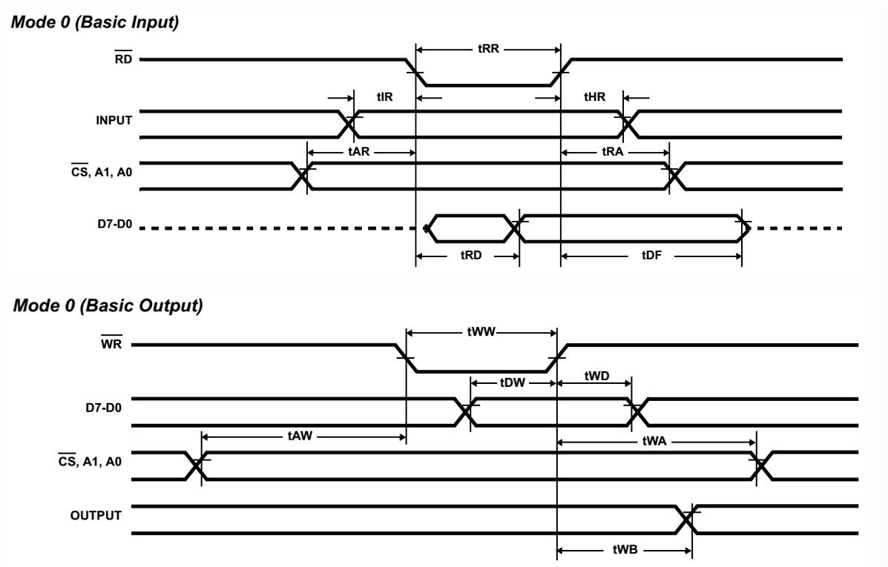
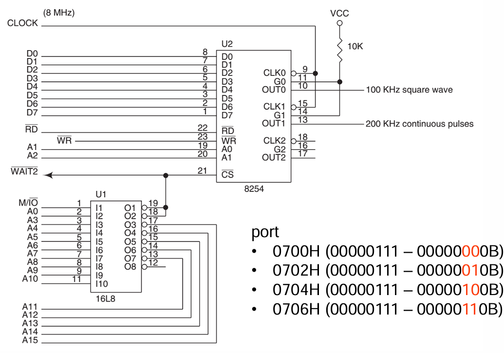
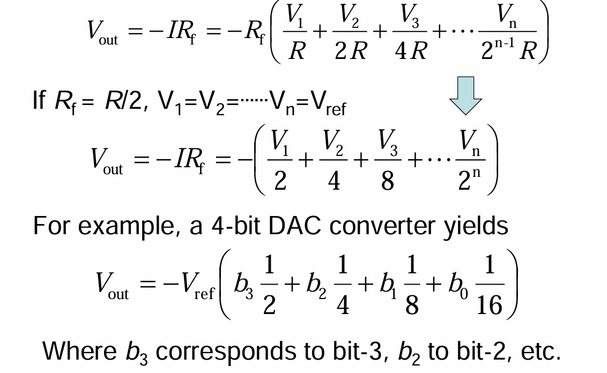
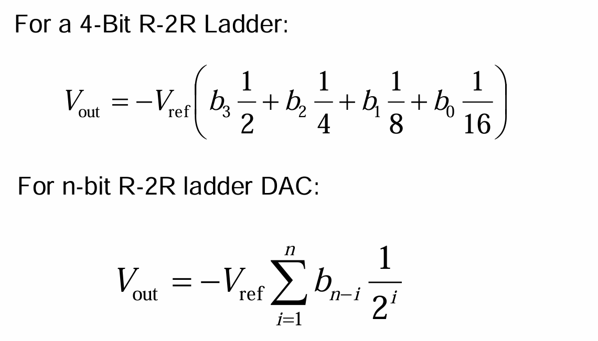

# 笔记

x86 平台的运算资源

IA-32

段寄存器

A: Accumulator, (累加运算有特殊的编码，较短)
B: Base index, C: Counter, D: Data

通用寄存器

EFLAGS

EIP

MMX (多媒体扩展) 复用了 x87 FPU 的寄存器的低 64 位，可以进行整数的向量化
要进行浮点运算，需要用 EMMS 指令切换回 x87 FPU

XMM[0-7]

IA-64

通用寄存器增加到 16 个: RAX, RBX, RCX, RDX, RSI, RDI, RSP, R[8-15]
SSE2 寄存器: XMM[0-15]


8-bit: R8B-R15B
16-bit: R8W-R15W
32-bit: R8D-R15D
64-bit: R8-R15

出于兼容考虑:
写入 EAX, RAX 高位清零。但写入 AX, AL 时，高位不动。

EAX 会让高位清零，所以不用必须看成 RAX 的 partial register，
可以通过寄存器重命名让 EAX 实际上由多个寄存器并行运算

但是一段代码里如果出现 EAX 和 AX，那么就没法做寄存器重命名了

RFLAGS, EFLAGS, FLAGS:
Parity Flag, Auxilary FLag


Memory Management Requirements
软件与硬件配合的内存管理

- Relocation: 重定位
- Protection: 保护与隔离
- Sharing: 共享部分资源 (父进程 -> 子进程 -> 线程)

历史上的管理方案:

- Segmentation: 分段机制
- Paging: 分页机制

Pitfalls:
Segmentation leads to external fragmentation,
Paging is subject to internal fragmentation

Segmentation are faster than paging table lookups
Paging needs MMU and TLB to accelerate look up

Legacy Mode:
实模式: 16+16 Segmentation
虚拟 8086 模式: 16+16 Segmentation + 可选 Paging
保护模式: 16+32 Segmentation + 可选 Paging
Long Mode:
兼容模式: 16+32 Segmentation + 必选 Paging
64-bit 模式: 64-bit Paging

内存寻址:

1. 实模式
    (Segment Addr << 4) + Offset Addr = Physical Addr
    - Relocatable
    - Shared
    - No protection
    问题:
    - Wrap Around: FFFF:FFFF -> 0x10FFEF 超出了 1M 空间 -> 变成了 0x0FFEF
                   F800:8000 -> 0x100000 -> 0x00000
                   Only happens on 8086 / 8088 / 80186 until 80286 upgraded to 24-bit address lines
                   https://www.os2museum.com/wp/the-a20-gate-fallout/

2. 保护模式
    16-bit Segment 指向全局描述符表 GDT 里的一个描述符 (descriptor)
    段的基地址，长度和权限
    设置了 CPU 的运行级别 ring-0 ... ring-3

    空描述符:
    1. 在初始化时，段寄存器还没有设置好，但可能发生意外，成为了段的选择值，
    这时候让他们 (=0) 都指向空描述符，就可以触发 #GP (general protection) 异常，而不造成问题
    2. 判断中断是否嵌套

    描述符的结构:

    Limit 段长度, Base 基地址 (80286: 24-bit, >=80386: 32-bit)
    Access Right 访问权限
    G 粒度位: 为 1 时，Limit 长度 1bit 代表 4k, 4k * 2^20 = 2^32
    D, AV

    在 64-bit mode, 绝大多数部分不再使用，新增了 L 位，
    需要开启 Long bit 来进入 64-bit 模式

    必考计算:
    G=0 limit 1 bit = 1b, segment size = (limit+1) bytes
    G=1 limit 1 bit = 4kb, segment size = (limit+1)x4k bytes

    eg: Base: 1000 0000, limit: 001FF
    G=0, 1000 0000 - 1000 01FF
    G=1, 1000 0000 - 101F FFFF (结束位置 = 起始位置 + 段长度 - 1)
    左移3位，补FFF

    Access Rights:
    1. P 位 表示描述符是否有效
    2. DPL 位 (2 bit):
        Ring 0, Ring 1, Ring 2, Ring 3
        不得越权访问，需要通过 Gate Descriptor
    3. S 位 表示是否为系统描述符
    4. Type: 代码 / 堆栈 / 数据， 以及读写权限

    5. A 位: 段是否被访问过

    选择值 (CS / DS / SS 存的 16-bit):
    1. 15-3 (13-bit, 8k 个描述符): Descriptor index
    2. 2: TI, 表示描述符索引在 GDT (全局描述符) 还是 LDT (局部描述符)
    3. 1-0: RPL 选择值自身的权限 Ring 0 - Ring 3

    安全级别的设置:
    1. DPL 描述符权限级别
    2. RPL 请求的权限级别，放在 DS 寄存器的低 2 位
    2. CPL CPU 自身的权限级别，放在 CS 寄存器的低 2 位

    RPL 和 CPL，通过门描述符越级执行高权限的代码时，请求的内存地址还是原来的权限级别

    数据需要 MAX(RPL, CPL) <= DPL
    堆栈需要 CPL = RPL = DPL

    描述符表的基地址由专门的寄存器存储: GDTR 全局描述符, LDTR 局部描述符, IDTR 中断描述符


Chapter 3 寻址方式

默认地址长度和默认操作数长度:


在默认情况下指令编码较短

比如 64-bit 模式下 `mov eax, [rbx]` 操作数长度为 32 位，地址长度为 64 位，编码为 `8B 03`, 相比之下 `mov rax, [rbx]` 的编码为 `48 8B 03`.


Part 1 数据相关的寻址

操作数可以是立即数，寄存器和内存上的值

1. 寄存器寻址 `mov ax, bx`
2. 立即数寻址 `mov eax, 12345H`

需要注意: 16进制数字字母开头时，前加0，否则会被理解为 label


注意划线


寻址方式:

1. ```Effective Address = Disp```

如果目的寄存器是 A 系列的寄存器，指令编码会短

```assembly
mov al, [1234H] ; A0 34 12
mov cl, [1234H] ; 8A 0E 34 12
```


2. ```Effective Address = Base```

8086-80286, 只允许使用 (base register:) bx, bp, (index register:) si, di 来作为基址寄存器

80386 及之后可用任意 32 位通用寄存器

64-bit 模式，段寄存器不用来进行寻址

bp寻址时，默认段寄存器为 ss


上面的 size directive 如何影响指令编码:


3. ```Effective Address = Base + Index```


movsx 的使用非常细节，char -> int 的转换发生在这里

3. `Effective Address = Base / Index + Disp`

4. ```Effective Address = Base + Index + Disp```

可用于二维数组/结构体的索引

5. ```Effective Address = Base + (Scale×Index) + Disp```

也可用于二维数组/结构体的索引, scale 可以是 1, 2, 4, 8


64 位的新寻址方式: RIP relative addressing

平坦内存方式，没有什么段了，可以直接用 rip 和偏移量寻址


实际上只用了 48 位虚拟地址，所以高 4 byte 必须是符号扩展，否则触发 #GP


总结: 8 种内存寻址方式


base 和 index register 的选择:


特殊规则: 

1. 只要出现 BP/EBP, 或者 ESP, 那么段的基地址默认就是 ss
2. ESP 不能做索引 index 寄存器

例题:


ESP 只能做 base 不能作为 index，所以 D 是错的


Part 2 代码相关的寻址 - 与程序控制流的指令有关

 

Relative offset: 基于 ip + offset 跳转

Absolute offset: 基于绝对地址跳转

跳转方式与距离:


指令编码: 71AC - 71AA = 2


Far jump 跨段跳转时，必须跳转到相同 ring 级别

进入保护模式时，cs 从段变成一个选择值，要刷新 cs，而只有跳转指令可以更改 cs

jmp 还可以使用内存里的值作为偏移
```asm
jmp near ptr[di+2] ; 2 Byte, Offset
jmp far ptr[di+2]  ; 4 Byte, Segment + Offset
```


栈内存的地址寻址方式

栈的操作: push, pop，LIFO

可以入栈或出栈的: 通用寄存器，标志寄存器，浮点寄存器，立即数

入栈按照小端格式，也可以理解为: 高位先入栈，低位后入栈，低位先出栈，高位后出栈

pusha (push all): 存入所有通用寄存器，不包括段寄存器（段寄存器不是通用寄存器），sp 为入栈前的值

pushad (push all double): 存入 32 位寄存器

pushf (push flags): 存入 flag 寄存器


Chapter 4

2-bit 编码 3 种指令操作模式


指令编码格式:


```masm
mov word ptr [eax], 5 ; 67 66 c7 00 05 00 - 64-bit
mov word ptr [eax], 5 ;    66 c7 00 05 00 - 32-bit
```

最长的指令能达到 15 Byte


OPCODE 中的方向位和宽度位


D=0 数据由 R/M 到 REG

D=1, 数据由 REG 到 R/M

W=0, 数据为 byte, 8 位

W=1, 数据为 word / doubleword


MOD Field, 指定寻址方式


REG/Opcode Field


20/r 表示两个域都是寄存器，opcode 为 0x20

80 /4 ib 表示 MOD 不是放寄存器，/4 表示扩展一个操作码，MOD 第二个域 R/M 设置为 3'b100，合起来代表带了一个立即数

指令编码解析:


32 位下，几乎所有寄存器都可以作为 index （除了 esp）

此时 R/M 域的编码有扩展


REX 寄存器扩展前缀，可以用来去找 r8-r15 这些寄存器，补充了原来的编码


Legacy Prefix: 组内不能重复，组之间可以组合


1. 重复
2. 段改写
3. 操作数长度变化
4. 寻址长度变化

LOCK 前缀: 原子操作，给不支持的指令加，会报 undefined opcode 异常





0FH 转义序列


扩展 opcode 的编码空间


lea 用来灵活地计算地址偏移 / 简化计算

mov 类指令不改变 flags


mov 的时候，汇编已经把 offset 算好了，

而 lea 需要执行的时候才开始计算

但 mov 只能是静态的立即数，lea 可以用地址表达式，可以组合多个寄存器

装载指针的指令: lds, les, lfs, lgs, lss


任务切换的时候可以用这个


字符串操作指令: lods, stos, movs, ins, outs

字符串比较指令: scas, cmps

指令编码短，因为隐藏了操作数  (esi, edi / ds:si, es:di 以及 ecx 作为最大比较次数)，前加 repe 前缀

这一套指令都有后缀: s, w, d 代表单次操作的长度


rep 重复前缀也是一系列的:


bswap 交换字节序

因为没有 MOD， 编码寄存器放在了 Opcode 里，0F C8 的后三位
64 位时，再和 REX.W 中的 1 位组合，编码 16 个寄存器

条件移动 cmov， 根据 flags 中的状态位进行移动
cmov 的好处在于可以减少 if-else 的分支指令，减少 branch misprediction


Memory Organization

```text
name SEGMENT
name ENDS

name MACRO
ENDM (不需要再写一次 name)

END start -> 指示入口点
```


Arithmetic and Logic Instructions

INC 指令保持 CF 不动，其他的 Flags 都有可能更新

递增指令往往用于循环，希望这个递增变量不要干扰循环里面的 CF

ADC 带进位加

较长的二进制数加法用循环和 ADC 指令实现

在开始前需要用 clc 清除进位 flag


细节: **这里使用了 lea，lea 属于内存移动指令，不影响 flags，同理 dec 也不影响 Carry Flag**

而 ADD 指令会影响 Carry

变种带进位加法指令: adcx, adox


相当于 Ripple 加法器到超前进位加法器的变化

原来只能有一条 Carry Chain, 不能冲突，

后面英特尔引入了 adcx 和 adox，允许两条 Carry Chain，分别使用 CF 和 OF，提高了并行性 （2012）


adcx 使用 Carry Flag，不会修改 Overflow Flag

adox 使用 Overflow Flag, 不会修改 Carry Flag

上面的代码有一点小问题，因为 dec 不会破坏 CF，而会破坏 OF，但是 dec 在正常循环中不产生 OF

Karatsuba 算法: Intel 还设计了 mulx 指令


xadd (> 80486)

先进行源和目标数据交换，并把源加到目的操作数里 des = src + des

很少的改变 src 的指令

xadd 其中一个操作数可以是内存，因此可以用来做锁

乐观锁与悲观锁:

spin lock 是悲观锁: 认为很大概率冲突，在进行事情前上锁，结束后解锁

乐观锁：有并发，但冲突可能性较小，先做动作，再检查是否冲突


减法: sub, dec, sbb 带借位减法（全减）

Compare and Exchange

先做 compare 再做 exchange

CMPXCHG des, src (隐藏操作数累加器: AL/AX/EAX)

- if des == accu, then des = src, ZF=1
- if des != accu, then accu = des, ZF=0


div, idiv, mul, imul 区分有无符号，最主要的区别是进行扩展时高位如何填充

而 add 和 sub 不需要管，因为补码算出来就是对的


符号扩展指令:

CBW, CWDE, CDQE： A 系列寄存器有符号扩展

CWD,CDQ,CQO：AX -> DX:AX 扩展

MOVSX, MOVSD：移动+扩展

MOVZX: 零扩展


历史遗留指令，BCD 与 ASCII 指令:

- DAA, DAS 对 BCD 码进行运算

```asm
mov al, 35H
add al, 48H
daa

mov al, 35h
add al, 65h
daa
# al: 00, CF: 1
```

- AAA,  AAS, AAM, AAD 对 ASCII 码进行运算:  ASCII: `30h-39h`

```asm
aaa ; if AL[3:0]>9 or AF=1, then AL+=6, AH=1, clear AL[7:4],CF=1, AF=1; else CF=0, AF=0
mov al, '3' ; 33h
add al, '4' ; 34h, al = 67h
aaa         ; AH=0, AL=7h, CF=0, AF=0
mov ax, '1' ; 31h
mov ax, '9' ; 39h, al=6Ah
aaa         ; AH=1, AL=0h, CF=1, AF=1s
```

test 做与操作，不影响结果，只影响 flags


位操作指令

bt, btc, btr, bts

```
bt: 测试该位
btc: 测试，取反
btr: 测试，设置为 0
bts: 测试，设置为 1
```

not 取非

neg 取补，影响 flag


```
int signum (int x) 
{ 
    if (x > 0)  
        return 1; 
    else if (x < 0)  
        return -1; 
    else  
        return 0; 
}
```

```
signum-icx:
    mov     ecx, edi
    sar     ecx, 31
    test    edi, edi
    mov     eax, 1
    cmovle  eax, ecx
    ret
signum-minimum:
	cwd
	neg ax
	adc dx, dx
```


sar， sal 算数移位，补充符号位

idiv 和 sar 有时会不一样,idiv的策略是 round toward zero，而算数右移 rount toward negative infinity


修补: 在除之前，对被除数添加 (1<<k-1) 也就是加上低 k 位为 1 的数，如果被除数低 k 位存在一位为 1，那么就会进位上去，后面移位回去时，被除数这一位还保留，那么就实现了 round toward zero 的舍入模型


shldm shrd: 双精度移位，两个寄存器串在一起移位


ROL, ROR 不带 CF 循环移位

RCL, RCR 带 CF 循环移位

字符串比较指令 movs, lods, stos, ins, outs

以及两条影响 flag 的指令: scas (string scan), cmps (string compare)


di 回退一个位置才能找到 00


Chapter 6 控制指令

1. 跳转指令

无条件跳转

jmp short, jmp near, jmp far


jmp with register operand，寄存器直接拷贝到 ip，绝对跳转

jmp table[si] 跳表

条件跳转:


```asm
test word ptr[esi], 8000h ; 与符号位做 test
pushf ; 保护 flags
add esi, 2
popf
```


跨权限控制流转换

- conforming code segmentv设置为一致性代码段，可以允许低权限的代码来调用，用于共享库
- 门描述符
- 快速系统调用

中断和异常:

- 中断: 外部中断: 异步，软中断: 同步。 特点: **主动**请求 os 服务
- 异常: cpu 运行时发现异常让 os 处理

异常的来源:

- Program-Error Exception: 比如除以零
- Software-Generated Exceptions: into (overflow), int1, int3 (software break-point)
- Machine-Check Exceptions: 机器自检异常，比如跑着跑着拔掉内存

异常的种类:

- 精确异常: 
  - 发生异常的位置定位是准确的，所以系统处理完可以继续在断点执行下去的 (can be restarted)
  - 比如 Page Fault 之后，页面载入内存，可以从断点继续执行
- 非精确异常: 
  - 异常的位置是不准确的
  - not restartable

另一种分类:


中断入口:

- 实模式: 中断向量表，向量号:
  - 向量号为 2 的是不可屏蔽中断


用户只能自定义中断，且向量号在 32-25

- Double Fault Exception: 在处理异常的过程中又出现了异常
  - 比如处理 Page Fault 的时候，如果没写缺页异常的处理代码，就会再报出一个异常
  - 并不是所有的嵌套异常都是 Double Fault Exception
    - 必须满足某种组合
    - 
  - 双故障异常必须要特别小心地处理，不能再出现异常
    - 如果触发三故障异常，系统就会立刻重启

- 保护模式: IDT

异常的错误码: 选择值类，以及 Page Fault 错误码


- Page Fault 有两种: 真的缺页，还有访问权限不够
- cr2 存储发生 Page Fault 的虚拟地址

中断/异常的优先级分级，优先级高的可以打断其他低优先级中断的处理过程:


- 相同优先级的异常来的时候，是嵌套还是排队，取决于机器的实现

实模式的中断向量表查询：


实模式进入中断服务函数前向栈压入 flags, cs, ip:


回去的时候要 iret，32位模式要 iretd


控制指令: 

carry flag stc, clc, cmc (complement carry flag)

HLT: 停机指令，系统处于热等待状态，需要下面的条件来激活:

- NMI, SMI 不可屏蔽中断，系统中断
- debug exception
- hardware reset，BINIT#, INIT#, RESET#

多字节 NOP: 最多可以十五字节


多字节 nop 的意义: 希望代码对齐，用来做填充指令

一条十五字节 nop 和一条单字节 nop 差不多，但远比 15 个单字节 nop 好

Lock: 


- 用于“读, 修改, 写回”的指令变成原子指令

bound 检测是否在两个范围之间


接口部分

Min Mode 和 Max Mode


minimum mode: 直接发送控制信号，有完全的管理权限


maximum mode: 发送请求，等待总线芯片 （8288） 仲裁


BHE: Bus High Enable 指示总线高八位数据有效


DRAM:


Channel -> DIMM -> Rank -> Chip -> Bank -> Row / Column 到达单 bit

8086 的 bank 以 1 字节为宽度来组织内存


单字节 & 偶地址: $D_7-D_0$

单字节 & 奇地址 $D_{15}-D_8$ 

双字节: $D_{15}-D_0$

三种状态，需要两位信号来控制，就是: $A_0$ (BLE) 和 BHE 信号


未对齐地址的访存需要拆成两个周期


硬件接口需要解决的 6 个问题:


1. 高低电平的逻辑匹配
2. 增强信号（电流）
3. 匹配速度: 缓冲 / 锁存
4. 匹配时序
5. 总线隔离
6. 匹配格式


- 输入/输出: 输入输出都以 CPU 的视角来看，输入设备连接输入接口，...

- 信号类型: 数字信号、模拟信号
- 传输类型: 串行传输、并行传输
  - 并行传输不一定比串行快，并行信号有串扰，频率不能太高


典型的 I/O 接口（粉色）由四部分构成:

- 读写控制逻辑
- 端口寄存器
- 总线 buffer
- 控制和状态寄存器


接口需要进行缓存

与设备的同步:

- Always-on Devices: 无条件传输，不需要沟通，比如开灯，直接传输就好
- Strobing 选通信号，只有单向发送的信号，没有回应信号
- 双向的:
  - Handshaking, Polling
  - Interrupt-driven I/O
  - Channel-based I/O (DMA)

I/O 地址编码有两种:

- 独立 I/O 编码: 用额外的指令处理 I/O 访问: x86 的 in 和 out
- 内存映射: 读写外部设备和读写内存的方式一样


000-3FF 由系统定义

400-FFFF 可由用户自定义

逻辑芯片的分类: TTL & CMOS


- TTL 逻辑: 三极管
  - (曾经) 速度快，驱动电流大
  - 消耗能量高
- CMOS 逻辑: 场效应管

TTL

最主要工作电压 5V

输入输出的标准非对称：宽进严出


CMOS

工作电压有很多种:5V, 3.3V, 1.8V


要考虑两个器件输出和输入的要求（0 和 1 传过去仍然应该认为是 0 和 1），电压要匹配


第一种类型需要上拉电阻

机械开关触点接触不稳定，存在“抖动”问题:


去抖动的方式:

- 软件: 多次采样，稳定后才认为变化
- 硬件:
  - 解决方法1: 问题在于之前是双触发，需要做成单触发，一接触到就直接变，不会抖动
  - 
  - 解决方法 2:
  - 解决方法 3：多次采样，匹配
  - 


输出电流的匹配: 加驱动电路

驱动 LED: 10 mA

用晶体管可以放大电流，要计算电阻大小确保匹配

LED 有压降（-2V）


驱动更大的设备: 1A 的直流电机

Darlington-pair: 晶体管串联级联放大


电动机是电感，关闭的时候会产生反向电动势，需要加一个放电回路（稳压二极管），否则立刻把达灵顿击穿了

8位开关:


8个 LED 输出: 共阳极，对应位变 0 就点亮


Strobing 选通时序

1. 源主动选通，数据先放到总线上，发送选通信号，发送之后再延续一段时间，给目的单元读取的时间


2. 目的主动选通:

目的拉高选通信号，源把数据放到信号上，目的关闭选通信号，源把信号从总线拿走


Handshaking 握手时序

1. Source-initiated


2. Destination-initiated


I/O 端口地址译码


对地址进行译码，高 5 位负责选中某个 decoder （比如图上的decoder只有在高地址 10000 才使能），低 3 位地址使能 3-8 decoder

IO/M 信号指示当前的地址是 I/O 还是内存地址

再举一个例子，对于 F0h-F7h:


16 位端口地址 EFF8h-EFFFh，用一个可编程逻辑器件 (PLD) 来译码


输出 8 位: 偶地址，奇地址 —— 要控制 BHE 和 BLE



如果输出也是 16 位，译码就相对简单，因为此时内存地址必须双字节对齐


数据宽度32 位时:


**接口芯片**

1. 82C55：可编程并行接口 （8255 + C 代表低功耗的 CMOS）

端口地址与数据宽度均是八位的


A[7:0] 与 C[7:4] 构成了 A 控制组，B[7:0] 与 C[3:0] 构成 B 控制组

C 被分成两部分用来配合信号线 A 和 B 做握手信号


- A0, A1 选择对哪个端口进行操作

- CS： Chip Select 低使能这个芯片

控制信号与数据流向


A和B端口中，A更强大:

A有独占的输入 latch，输出 latch/buffer

B 只有输入 buffer 和共享的输入输出 latch/buffer


Mode 0: 无握手信号，基本的输入输出

Mode 1: 选通式握手

Mode 2: 双向总线操作，可在不同时间做输入输出（而前面的输入输出是确定的），仅适用于控制组 A


Mode 0 适合 Always On 没有时序逻辑的设备，比如 LED 灯

Mode 1 适合选通

Mode 2 此时 C 端口有五条线可以配合 Mode 2 的 A 端口，双向各两条，再来一条中断线

82C55 接到 80386SX 上时:


为什么使用 C0, C2, C4, C6 而不是 C0, C1, C2, C3: 为了让端口都在偶地址上，避免在译码的时候还需要引入类似 BHE 的信号


1 = I = Input, 0 = O = Output


Mode 0 的操作:

时序图:

上升沿触发，输入后 tRD 之后的才是有效数据



- 输入
  - 首先给出片选 CS 和端口地址 A1, A0
  - 其后输入数据需要给出
  - 然后 CPU 发出 RD 信号
  - 随后端口锁存住的外部输入就可以读到 CPU 的输入总线上来 D7-D0
- 输出
  - CS, A1, A0
  - CPU 将写的数据放到数据总线上
  - CPU 发出写信号

步进电机

激励方式: 全步 full-step，半步 half-step，微步 micro-step

一相充电和两相充电: 90°


半步: 单相和两相搭配 45°


代码:


最高位是 ready bit, 系统自动设置


micro-step: 精细控制每个线圈的电流


用到串联的达灵顿管和二极管


微步: CX 最高位代表方向，后面 15 位表示多少步


Mode 1:


输入:


IBF: Input buffer full

终端使能 INTE： PC4 (Group A)， PC4(Group B)

模式1的工作模式可以从端口C读取:


可以一个字节整个读进来

模式1 输入例子: 键盘

输出:

CPU 给 82C55 输出数据，由 82C55 锁存

当缓冲区慢时，OBF 变成低电平通知设备来读

设备发送 ACK，随后 82C55 向 CPU 发送中断信号，

让 CPU 继续来写


模式1输出例子: 打印机

串口打印机


故意不用 PC1 而是用 PC4 产生 OBF 信号，是为了展示 Command Word B 的用法

模式2：双向操作方式，只能组A


中断线复用，再占 OBF, ACK, STB, IBF, 一共占 5 条线

此时组 B 最多在模式 1，把所有线用满

时序图:


总线是竞争的:

虽然 CPU 先设置的 WR 信号且 82C55 已经 OBF 了

但是此时外部设备已经把给 CPU 的数据放到总线上了，所以 CPU 只能先读走

因此 CPU 的写数据只能在其后面再放到总线上

中断请求也是竞争的:

CPU 接收到中断时，如何知道是让它写还是读?

CPU 只需要读取 C 口的 OBF 和 IBF 的状态即可

若 OBF 和 IBF 同时有效，那既要读又要写

如果只要有一个，那就响应那个就可以了

模式2的编程:


组A模式2和组B模式1同时用，达到满载:


**8254 可编程定时器**

控制设备，发送控制信号

3 个独立的 16 位时钟计数器，既可以二进制，也可以 BCD


Timer 0: 给 CPU 发送时钟中断，接到 8259 中断控制器

Timer 1: DRAM 内存的 refresh 时钟

Timer 2: 驱动喇叭


CS: 片选信号

A0, A1 指定某个计时器

一个 counter 的内部结构:

控制字三个计时器复用

CR_M, CR_L: 两个 8 位计数初值

CE: 16 位倒计时计数

OL_M, OL_L: 两个 8 位输出

8254 的命令字:

SC1/SC0: 11 表示回读，获得计数器的状态

RW1/RW0: 读低位计数初值，读高位计数初值，还有两个都读（低位 LSB 先写）

M2/M1/M0: 计数器工作模式

命令字需要向命令端口写，地址为 A1,A0 = 11


读取 8254 的时序图:


写入 8254 的时序图:


8254 每个计时器都要设置一个命令字

写入计数初值之后，只要门控信号有效，就开始计数

初始化: 先低字节，再高字节

16位:

- 二进制 0~FFFF
- BCD: 0~9999
- 计时器是先减再判断，因此初值设置为 0 可达最大计数次数


Mode 0


Mode 1


高电平门控信号被采样到，再重新载入初始值

期末必考 2024.12.20 开头

Mode 2 - Rate Generator

OUT 绝大周期高电平，计数到 1 的时候才变成 0

门控信号影响输出:

门控信号 Gate = 0 (无效) 立刻将 OUT 变成高电平

直到下一次门控信号有效时，重新装入初始值，再开始计数


采样到 GATE=0, 下降沿停止计数

当 GATE=1 恢复时候，重新读入初始值 03

Mode 3 - Square Wave Generator 方波发生器: 占空比 50%

如果输入时偶数: 比如 6, 那么 3 拍高，3 拍低, 占空比 50%

如果输入为奇数: 高的周期必低的周期多一个，占空比 $\frac{n+1}{2n}$


Mode 4 - 软件触发选通，可以类比模式 0

到达 0 的时候，只产生 1 个节拍的低电平


下降沿装入 03

Mode 5 - 硬件触发选通

只要门控信号产生上升沿就触发计数，即使没有被时钟信号采样到


8254 芯片的使用

例子 1: 接到 80386 计算机，用第一个计时器产生 100K 方波，用第二个计时器产生 200K 连续波

如果变化的两位放到最低两位的话，会需要用总线高信号来做片选比较麻烦

时钟节拍为 8 Mhz，门控持续使能，接到上拉电阻



计数初值计算:

模式 2 和 3 都是 N 分频，也就是频率变成 $1/n$.


如果要 100 Hz 方波怎么办？ 8 Mhz / 100 Hz = 80000，而最多只能计数 65536 怎么办

串联分频，把第一级的 out 接到第二级的 clk

代码:

- 100K 方波，需要工作在模式 3

先写命令字，再写计数初值，先低字节再高字节（为了展示两字节的写法，所以 RW1,RW0 设置成了 11）

考试要求记忆地址


- 200K continuous pulse，需要模式 2

读取计数器的值


Simple Read:

推荐设置门控信号让计数停止一下再读，但直接硬读也不是不行，就是会不太稳定

Counter Latch Command: 计时器锁存命令

D5,D4=00 指定计数器锁存指令，SC1, SC0 表示锁存哪个计数器的值


注意读取的顺序和当时设置这个寄存器的时候，低字节、高字节的设置是一致的，比如一开始是 11，那么读的时候也是先读低字节再读高字节


回读命令的格式:

可以读 count 也可以读编程模式，输出的引脚是高电平还是低电平，Null Count Flag: 是否被初始化过


Count 是 0 代表像读计数值

Status 是 0 代表读取状态: 编程模式，OUT， Null Count Flag


最高两位必须是 11， 最低必须是 0


PWM 驱动电机

H-桥


不仅可以控制速度，还可以控制方向


50% 占空比是停止，变低和变高都会开始转，方向相反


Mode 2,3 比较特殊，既可以电平触发，也可以边沿触发

边沿触发的作用是重置计数，而电平触发是开启或关闭


16550 串行通信芯片

单工，半双工，全双工:


串行通信: 只能一位一位传输


第三步需要使用信道上面的编码（类似计网），让 0 和 1 更易区分，抗干扰
在数据编码中还要提供同步信号，并且每个数据包都要添加同步信号，避免错误累计

有效载荷 Payload 封装好后，在发送时钟的驱动下，用移位寄存器一位一位发送出去

接收端在接收到起始位时同步自己的时钟，最后还要利用校验位进行检验

如果没有问题，就串转并传输给 CPU

**Clocks and Timing**:

时钟需要考虑采样信号能量最大的点: 中心点采样

时钟有两种可能

- 同步数据传输 (同步的情况无需 start bit 和 stop bit)

  - 时钟同源: 发送和接受端使用相同的时钟源

  - 时钟异地: PLL 锁相环: 负反馈计数，作差能够锁定和数据相同频率的时钟

- 异步数据传输

  - 需要有相同的数据传输速率: baud rate
  - 需要起停位来进行时钟的同步

同步与异步数据传输的不同:


串行通信: UART / USART

UART: Universal Asynchronous Receiver Transmitter 通用异步传输

USART: 同时支持异步和同步


在编码中体现时钟的跳变，在持续传输相同位的时候，依然能体现时钟信息:

NRZ: 0就是低，1就是高，在 stop bit 的时候，持续高电平，就无法同步时钟了

NRZI: 0 就是保持，1 就是反相，在截止位持续高电平的时候很有帮助


USB 使用 NRZI


异步数据传输协议:


有效载荷，校验位，停止位的长度可变，体现出可编程的特性

以 UART 为例，需要接收端和发送端约定波特率 baud rate

这里并不是有效数据传输的 bit rate，而是编码之后的信号的 baud rate

baud rate: 9600 bps,  1 bit 需要 1/9600 = 104.2 us 的时间

进行采样的时钟: 波特率时钟: BCLK

波特率时钟的频率需要是波特率的数倍 (8, 16, 32...)

BCLK = baud rate x baud rate divisor (波特率因子)


使用了过采样的方法，乘了波特率因子的时钟频率

晶振产生时钟频率 - 分频 (divisor) - BCLK (带有过采样因子 baud rate divisor)

因此分频系数 divisor: input clock / (baud rate x baud rate divisor)


计数到波特率因子一半个周期的时候，发现还是 0 就认为这是起始位

随后每 波特率因子 个周期采样，便可以采样到通信过程中信号最稳定的时候的电平


16550 通信芯片: 美国 National Semiconductor Corp

注意字节序: **least significant bit** 低有效位优先传输


16550 baud rate 最高可以达到 1.5M

需要编程 (计算 / 查表获得分频系数 divisor) 产生波特率时钟，波特率因子固定为 16

提供一个 16 byte 的 FIFO 缓冲，以防止 CPU 没有及时读到

功能列表

- 可编程的载荷 / 校验 / 停止位长度, 1.5-bit 是指该位的时长是一个半
- 调制解调器功能: 把数字信号做调制变成模拟信号，加载到电话线上，电话网络普遍存在，且线的质量好 (拨号上网)
- 全双工: 有独立的发送和接收器


引脚规定:


地址线 0-2 三根，但是后面利用复用的方法，提供了 12 个端口

CS 片选有三根，为了兼容性，实际上只用一个就行，其他的必须 disable （或门）

读和写都有两个，也是为了兼容性，另一个必须 enable （与门）

ADS: 地址锁存信号: 并不是所有的芯片都能保证读写信号有效的情况下，地址仍然有效（比如摩托罗拉的 CPU）, Intel 的芯片没有这个问题，也不需要. 只要给 ADS 接低就行了

XIN, XOUT

TXRDY, RXRDY: 用于 DMA

INTR: 中断

SIN, SOUT: 串行数据的进出，全双工

BAUDOUT, RCLK: 两个时钟，一个是发送时钟，一个是接收时钟. 前者是内部产生的，后者可以从外部接过来

后面的是用来接调制解调器的


地址线 A0, A1, A2 可以索引八个寄存器


一个地址两个端口 （读和写对应的是两个端口）: 端口复用，最终有 12 个


scratch 寄存器是一个通用寄存器

DLAB 为 1 的时候，000 和 001 可以设置分频系数（分别是低有效字节和高有效字节）


16550 11 个常用的寄存器（另一个是 scratch)


有两个 FIFO 缓冲，由 FIFO Control Register 控制: 使能与清空

16550 的编程

1. 初始化：计算时钟分频因子，设置数据帧的格式
2. 清理 FIFO, 开始通信

线路控制寄存器的格式:


最高位是 DLAB 位

stick 打开时，校验位固定: 如果是奇校验为 1，如果是偶校验为 0，与有效载荷无关


波特率计算:


这个计算每次算太麻烦，而且不一定整除，所以习惯是使用查表:


清理 FIFO

初始化的完整流程:


波特率时钟直接接给接收端


状态寄存器:


OE: Overrun Error: FIFO 溢出了

PE: 奇偶校验出错

FE: Framing Error: 比如检测结束位长度不对，起始位长度不对

TH: 能否发送，需要轮询这一位

发送代码:


接收代码: (接收和发送时同一个端口号，靠读写作分离)


如果出错就返回 '?'


AD 转换 数字信号与模拟信号的转换


数字信号转换到模拟信号

OA: 运算放大器

有三种手段:

- PWM: 脉冲宽度调制
- 二进制带权值的电阻网络 Binary weighted resistor
- R-2R ladder


一般的数模转换芯片都是零阶保持，并不是连续的电压值，所以看起来会像下图中间这样:


使用的时候需要用低通滤波，避免谐波成分影响

二进制权值电阻网络:


运算放大器 - 运放 中的反馈电阻 Rf 做成 R/2，就能约掉电阻网络中的电阻项 R, 消掉之后就有:



R-2R 梯形电路

刚才那个方法，因为电阻值两倍两倍找不到通用的，因此比较难实现

R-2R 只要求两个阻值的电阻 R 和 2R 就能实现




两个容易混淆的概念: 参考电压 V_ref 和满量程输出电压 V_fs (Full Scale)

满量程输出电压达不到 V_ref, V_out 最大比 V_ref 差 1/2^n，差一个最低有效位的数值

数模转换芯片的主要参数:

- Resolution 转换精度: n = 3 位数字量，有 2^n=8 个间隔


**Resolution = V_ref / 2^n = V_fs / (2^n - 1)**

- Linearity
- Settling Time

Linearity 线性度

- 实际进行转换输出时，会由于种种原因会偏离理想的直线
  - 电阻发生了变化
  - 运放零点发生了偏移
  - V_ref 发生了变化


Settling Time 建立时间: 衡量性能


稳定到 理想电压 +- 1/2 的最小数字量电压 需要的时间，通过四舍五入可以归到这个值

计算例题: **有例题都是要点**


P1: 先算一个间隔是多少: 最高 15V/(2^4-1) = 1V, 0110 (6) 有 6 个间隔，所以是 6V

P2: Step size 就是 resolution

DAC0830 数模转换器


工作方式: 直通，一级缓冲，二级缓冲

引脚:


D0-D7: 数字量输入

IOUT1, IOUT2: 输出是电流，需要通过反馈电阻转换成电压，接到外接运放上

AGND, DGND 分别是模拟和数字信号的接地信号，避免干扰，数字量谐波成分大，会冲击模拟量

CS: 一级缓冲的使能

WR1, WR2: 两路缓冲，每路缓冲都有写信号

ILE: 输入缓冲使能信号

XFER: 传输控制信号，DA 转换控制器的控制信号

RFB: 反馈电阻，随着芯片已经配好了，但是是外接的

计算电压的时候，R_fb 应该能被约掉


IOUT1+IOUT2 是定值

R_fb 的接法:


两级缓冲:

latch: 没有时钟信号，输出跟着输入走

transparent latch: 有一个控制信号，控制信号为 1 时透明，输出跟着输入走，控制信号为 0 时锁存，不透明


第一路: 输入寄存器

- CS, WR1, ILE 来控制，同时使能时，直通（透明），否则数据被锁存（不透明）

第二路: DA 转换寄存器

- WR2, XFER 控制，都使能（低电平）时，直通

三种工作模式: 全部通-直通，通一个-单缓冲，两个都不通-双缓冲


最终接到 DA 转换

芯片使用时接法:


单缓冲模式例子


CS, WR1, WR2 全部使能，只有 XFER 受控 —— 一级缓冲直通，第二级受控

控制电机运转:

稳定运转: 第二级锁存

调速: 第二级直通，让输入的数字量进来，然后再锁存

双缓冲的意义:


接入多个 DAC 的时候，希望两个电机转速是同时变换的，而不能有时间差

分两阶段来控制，第一阶段分别把转速写入到两个 DAC 的第一级

第二阶段同时打开 DAC 的第二级，于是他们转速同时转变


分时写入，同时打开


期末复习:

填空题，单选题，计算，代码填空，简答

代码填空 考接口部分

IEEE 754 会考，负数，特殊情况

实模式，保护模式，64位内存寻址模式，都有考察

10101, 29912

寻址

伪指令

指令前缀 REX

- 64位模式操作数是64位
- 寄存器出现引用后面八个寄存器的 r8-r15

enter 指令

前面的芯片与编程相关，最后DAC0830考概念
