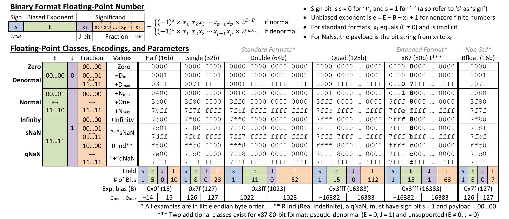
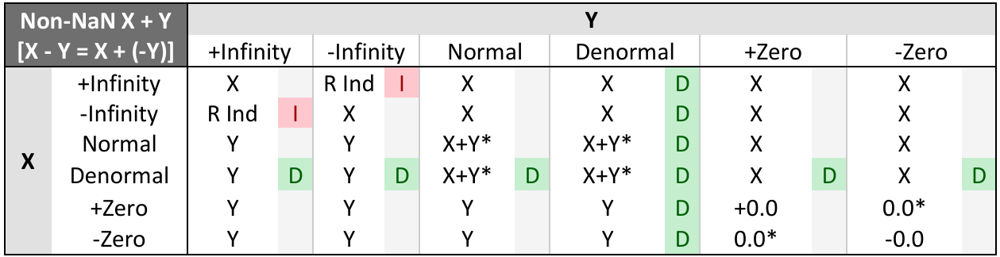
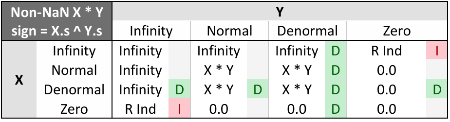
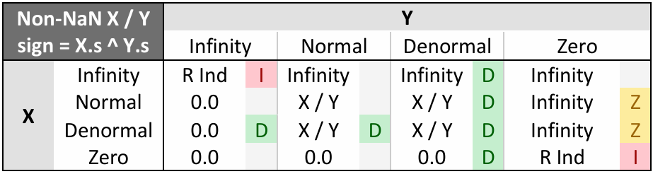

# 数据格式

## 进制转换

## 编码格式: BCD

[BCD](https://en.wikipedia.org/wiki/Binary-coded_decimal) (Binary-Coded Decimal) 是一种用二进制编码十进制数的方法，常用于数字显示和存储。由于历史遗留问题，在 x86 指令中仍然有很多操作 BCD 数字的指令。

BCD 有两种格式: Unpacked BCD (非组合型 BCD) 和 Packed BCD (组合型 BCD), 他们的编码方式如下:

- Unpacked BCD: 每个十进制数都用一个字节来表示，每个字节低 4 位表示十进制数，高位设为 0.

- Packed BCD: 将两个十进制数合成一个字节来表示，高 4 位表示高位十进制数，低 4 位表示低位十进制数。

## IEEE 754 标准

推荐阅读这个参考手册，里面介绍了 IEEE 754 编码格式，以及 Intel 处理器上浮点运算的全流程: [Floating-Point Reference Sheet for Intel® Architecture](https://www.intel.com/content/www/us/en/content-details/786447/floating-point-reference-sheet-for-intel-architecture.html). 下图截自该手册:

### 编码格式

- 32 位单精度浮点数: 1位符号位 + 8位偏置指数 + 23位尾数

  

    

    S
  

  

    <!-- 生成8个格子 -->
    

    

    

    

    

    

    

    

    Exponent
  

  

    <!-- 生成左右各3个格子，中间用省略号表示 -->
    

    

    

    
    

    

    

    Significand
  

- 64 位双精度浮点数: 1位符号位 + 11位偏置指数 + 52位尾数

- 80 位扩展精度浮点数: 1位符号位 + 15位偏置指数 + 64位尾数

    - 主要用于 8087 等 x87 浮点数协处理器中

总结一下:

| 数据类型 | 符号位长度 | 指数位长度 | 指数偏置量 | 尾数位长度 | 总位数 | 指针类型 |
| :---: | :---: | :---: | :---: | :---: | :---: | :---: |
| 单精度 | 1 | 8 | $127 = 2^7-1$ | 23 | 32 | `ptr dword` |
| 双精度 | 1 | 11 | $1023 = 2^{10}-1$ | 52 | 64 | `ptr qword` |
| 扩展精度 | 1 | 15 | $16383 = 2^{14}-1$ | 64 | 80 | `ptr tbyte` |

### 特殊表示

1. 负数:

    IEEE 754 中，负数的表示方法是将符号位设为 1，其余位按照正数的规则进行编码，并不涉及到负数的补码表示。因此，这里产生了正负 0 的区别。
  
2. 非规格数与无穷大:

    | 符号位 | 指数位 | 尾数位 | 类型 | 数值 | 例子 (32位) |
    | :---: | :---: | :---: | :---: | :---: | :---: |
    | $\pm$ | 0 | 非全 0 | 非规格数 | $(-1)^s \times 2^{-126} \times 0.\text{尾数}$ | 0x0000 0001 0x8000 0001 |
    | $\pm$ | 全 1 | 0 | 无穷大 | $\pm \infty$ | 0xff80 0000 0x7f80 0000 |
    | $\pm$ | 全 1 | 非全 0 Quiet = 1 | qNaN | 无效数值 | 0x7fc0 0000 |
    | 1 | 全 1 | 非 0 Quiet = 1 | R Ind (qNaN) | 无效数值 | 0xffc0 0000 |
    | $\pm$ | 全 1 | 非全 0 Quiet = 0 | sNaN | 无效数值 | 0x7f80 0001 |

    注: 尾数最高位为 Quiet / Signal 位.
  
    - sNaN (Signaling NaN): 会引发异常的 NaN, 用于标记未初始化的值，或者无效的运算结果.
    - qNaN (Quiet NaN): 不会引发异常的 NaN, 用来表示未定义的运算结果.
    - R Ind (Real Indefinite): 表示非法浮点数运算的结果，比如 0.0 / 0.0 或者 $\infty - \infty$.

### 浮点数运算

浮点数中，由于 IEEE 754 使用的是类似科学计数法的表示方法，再结合二进制的特点，使得浮点数乘除法运算比加减法要简单一些。

乘除法:

1. **符号计算**：根据两个浮点数的符号位确定结果的符号。
2. **指数相减**：将被除数的指数减去除数的指数，同时加上偏移值。
3. **尾数相除**：将被除数的尾数部分除以除数的尾数，通常需要增加精度来计算商。
4. **规格化**：如果商的尾数不在 [1, 2) 范围内，需要进行规格化调整并修改指数。
5. **舍入**：对尾数进行舍入操作

加减法:

1. **对阶**：将两个浮点数的小数位对齐，即调整较小数的指数与较大数的指数相同。这通常需要右移较小数的尾数，同时保持其数值不变。
2. **尾数运算**：完成对阶后，对尾数部分进行加法或减法操作。
3. **规格化**：结果可能需要重新规格化，确保尾数部分保持在 [1, 2) 的范围内。这可能需要调整指数，并对尾数进行左移或右移操作。
4. **舍入**：对规格化后的结果进行舍入以符合目标精度

### 非规格数运算律

在浮点运算过程中，一些意外情况下会使结果变成非规格数，非规格数分为 subnormal 和 denormal 两种。

非规格数之间，以及非规格数与正常浮点数的运算规则比较复杂，也不是很好总结，这里列出四则运算的规则，更具体的可以参考 Intel 手册。

**加减法** (将 X - Y 视为 X + (-Y)):

- 正常数 X 与非规格数 Y 运算，结果为 Y.
- $\pm 0$ 与 $\pm 0$ 相加结果为 0, 与其他数 Y 运算，结果为 Y.
- Infinity 与任何数运算均为 Infinity, 符号不变。$\pm$Infinity 相加为无效输入，结果为 R Ind.
- Denormal 数 X 与 Normal / Denormal 正常运算得到结果. 与 $\pm 0$ 运算，结果为 X, 与 Infinity 运算，结果为 Infinity.

**乘法:**

- 符号位为 $\text{X.s} \oplus \text{Y.s}$.
- Infinity $\times$ 0 类型的运算结果为 R Ind.
- 其他规则与加减法相同.

**除法:**

- 符号位为 $\text{X.s} \oplus \text{Y.s}$.
- Infinity / Infinity 和 0 / 0 类型的运算结果为 R Ind.
- 除了正常运算外，其他结果均为 0.

???+ tips "Intel 参考手册中的运算规则表"
    **加减法:** (将 X - Y 视为 X + (-Y))
    
    **乘法:**
    
    **除法:**
    