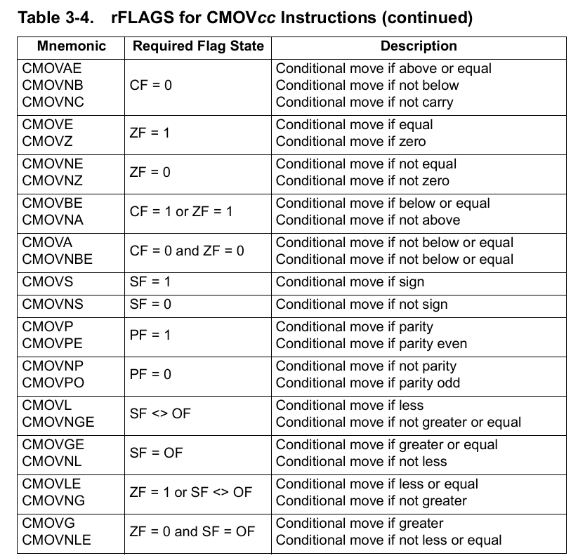
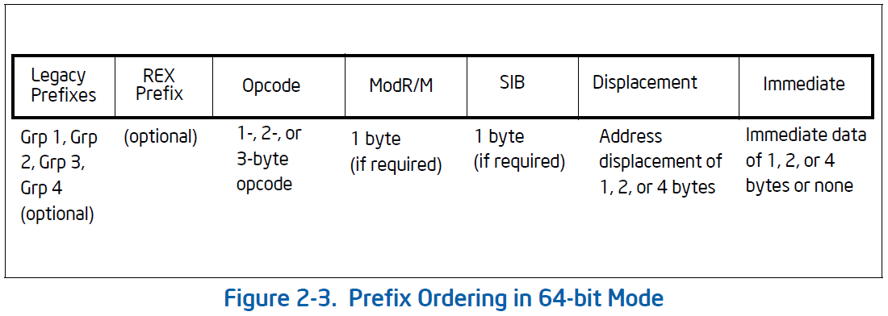
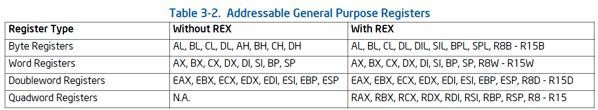
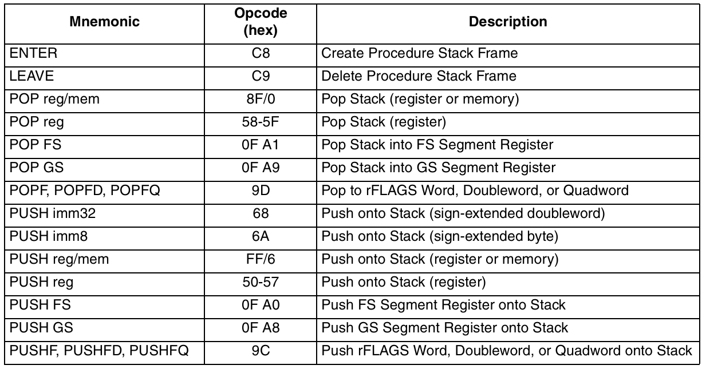

# x86 指令

## 数据传送 / 算数 / 逻辑 / 控制指令

### 条件数据传送指令

## 中断 / 异常

## 伪指令 Directive

## 指令编码

## 指令前缀

### REX 前缀

#### 功能

- W 位: 指示操作数大小, W = 1 代表 64 位操作数，W = 0 时根据 CS 选择符的 D 位确定
- R 位: 扩展 ModR/M 字段的 reg
- X 位: 扩展 SIB 字段的 Index
- B 位: 扩展 ModR/M 字段的 r/m, SIB 的 base 或者 Opcode 编码的 reg

#### 使用场景

需要 REX 前缀的情况:

- 使用 r[8-15] 及其部分寄存器的指令
- 使用 spl, bpl, sil, dil 寄存器 (sp, bp, si, di 的低八位) 的指令
- 使用 64 位操作数的指令

不需要 REX 前缀的情况:

在 64 位模式下，下面两种指令默认使用 64 位操作数，无需 REX 前缀:

- 近跳转: Near Jump 指令
- 除远跳转之外的所有用到 rsp 的指令，见下表:

#### 杂项

1. REX 前缀占据了 40H - 4FH 的 Opcode 空间，因此在 64 位模式下，原有的一些单字节 Opcode (如 inc, dec) 会被覆盖，需要用该指令的 ModR/M 形式.