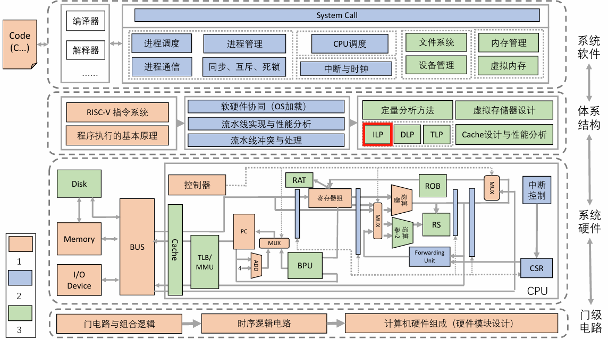
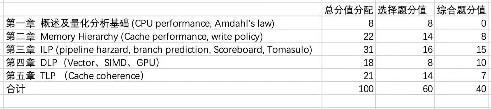

# 计算机体系结构

!!! 课程简介
    [常瑞](https://person.zju.edu.cn/changrui) 老师班，老师会强调体系结构是一门软硬件贯通的课程. 课程内容一图以蔽之:

    

!!! tip "课程考核"

    分数构成:

    1. 40% 期末考试
    2. 60% 平时成绩 = 6' 作业 + 6' 课堂展示 + 48' 实验

    期末考试范围: (2024-2025 秋冬)
    
    