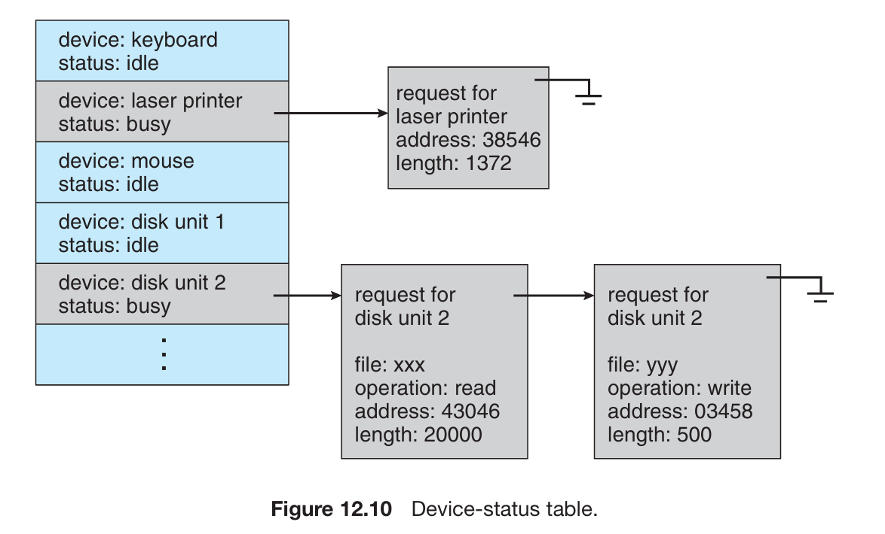

# 笔记

10 (出勤) + 40 (Lab) + 50

期末:

单选: 40 x 1.5=60

填空 10x1

大题 30: 内存必考（比较难），Synchronization 必考，Scheduling 必考

## Memory

1. 存储 0-1 bit 的地方, 8 bit 构成 1 byte, a byte's meaning depends on how you interpret it.
2. 每个 Byte 有自己的地址

## CPU

Register, ALU, Control Unit...

## DMA - Direct Memory Access


# What is an OS

OS:

- old school definition: resource abstractor and resource allocator.

Boot process:

- Boot loader
- init process
- wait for an event

Multi-programming:

- Single program
- Batch 
- **time-sharing**

Kernel size:
lean & mean: nothing more & single-minded


Syscall Instruction

- x86: int 80h
- x86-64: syscall
- ARM 64: svc
- RISC-V 64: ecall

Syscall Number: syscall table's index

Linkers and Loaders:

- ELF 的结构

Static Link: 可移植性强，二进制大

Dynamic Link: 可移植性差，二进制小

interpreter: ld-linux.so

Who setups ELF mapping: execve

start_kernel_thread_common: 静态链接将 entry point address 也就是 PC 赋值给 pt_regs 里的 PC，动态链接用的就是 ld.so 的


Monolithic: UNIX

Microkernel: Mach


# Process

## Concept

Process: A unit of resource allocation and protection.

进程：资源的组织和保护的单元，线程：执行的单元

program becomes a process when it's loaded into memory

Process:
code + data section (from ELF)
+ program counter + content of registers + stack + heap

Runtime Stack:
Stack Frame 栈帧
随函数调用不断变化

Invented by Dijkstra

ARM
```stp x29, x30, [sp, #-64]!```
x29: frame pointer, x30: link register / return address,
sp = sp - 64
```mov x29, sp```
update frame pointer

Stack 和 Heap 中间的空间有限
比如无限递归导致 stack overflow

## Control Block (PCB)

PCB: Process metadata 存储进程的元数据

process state, process number, process counter, memory limits, list of open files...

Linux 中用 `task_struct` 存储

pid: Process Identifier

State: 示意图必考
 - New: 进程被创建
    - Setup from scratch: 第一个进程
    - Fork: 父进程 -> 子进程，完整地抄过来，仅有 pid 不同
    `ps xao pid,ppid,comm`
    构成树形结构 Process Tree
    子进程挂掉可以由父进程重启，systemd 挂了，整个用户态就没了，内核会物理重启

    idle(0) - start_kernel(), systemd/init(1), kthreadd(2)
    kernel thread daemon 起内核态进程
    systemd 起用户态进程

    idle 原本的进程在 start_kernel 之后 fork 到每个 cpu 核心上，起 systemd 之后，退化为 idle
    CPU 没有任何任务可以运行时就会去运行 idle. idle 可以把 cpu 核心 shutdown 省电

  `fork()` System Call
  不接受参数，完整拷贝父进程，然后给父进程返回子进程的 pid，给子进程返回 0, 失败返回 -1
  `fork()` 是 syscall, 返回之后 PC 指向下一行汇编，于是父进程和子进程都从这里继续运行

    ```c
    pid1 = fork();
    printf("hello\n"); // 2 次
    pid2 = fork();
    printf("hello\n"); // + 4 次 = 6 次
    ```

  `exec()` System Call
  loadelf, 把原本程序后面的代码全都抹掉了，所以不 fork 直接 exec，后面的代码都不会执行
  如果 fork 之后父进程 exec 变成别的程序了，子进程结束后不会被回收，变成 orphan

  fork 的安全性问题，如果不分 systemd 和 kthreadd, 用户态进程可以根据自己的 memory layout 推测内核的内存映射

 - Terminate: 子进程 `exit()`, 父进程可以用 `wait()` `waitpid()` 等待子进程完成
    子进程结束会发送 SIGCHLD 信号
   强行结束，可以通过发送 Signal 完成
   Ctrl+C: SIGINT, 还可以发送 SIGBUS (segmentation fault 时), SIGKILL
   signal 可以自定义 handler, 除了 SIGKILL

   zombie: 不占用 CPU 但还占用内存的进程. Remain undead

   orphan: 父进程挂掉，子进程变成 orphan. Adopt by systemd / init on Linux, 原来是 pid=1，现在变成小号了
    orphan will never becomes zombie, systemd can handle it properly
    因此可以实现永远不会变成 zombie 的进程, fork 两次, kill 儿子，孙子就会被领养
    task_struct, mm_struct 等等都可以把 list_head 作为一个成员，从而成为双向链表

  - Ready, Running, Waiting:

  waiting queue 的数量 = waiting target 的数量

  Context: 寄存器
  Context Switch: 因为 CPU 的寄存器只有一份，要不然原来的进程回来的时候都不知道自己跑到哪了
  context switch 的时间是 pure overhead, 越短越好

  kernel space context switch

  user space context switch
   P0 User - 时钟中断 - P0 Kernel | context switch | P1 Kernel - P1 User
   kernel_entry 的时候，将 P0 的寄存器存在了内核的栈上，具体的位置叫 pt_regs (per thread regs)
   kernel_exit 的时候，将 P1 的寄存器恢复

  fork() 的返回值在哪里写的
  - 对于父进程，kernel_entry 进入内核后，pt_regs->regs[0] = pid
  - 对于子进程，copy_thread 的时候，childregs(也就是 pt_regs)->regs[0] = 0
    为什么 fork() 能返回两个值，因为 fork 之后有两个 user context, 可以修改

  fork syscall: kernel_clone() -> copy_process() -> copy_mm(), copy_thread 各种 copy

## Process Schedule

Scheduling: determine which process should run and for how long

决定了系统的吞吐量和反应速度

Pre'emptive Scheduling: 抢占式调度

Non-preemptive Scheduling: 非抢占式调度
跑到不想跑为止，不会出现 Running 到 Ready 的情况

Criteria and Objectives:

- Max CPU Utilization
- Max Throughput
- Min Turnaround Time
- Min Waiting Time
- Min Response Time

这些目标是互相矛盾的，需要权衡

Dispatch Latency: 两个任务切换之间的时间，Pure overhead 越小越好

Algorithms:

### First Come First Serve (FCFS)

    先到先得
会出现 Convoy Effect, 前面的太慢拖慢了整体的速度

### Shortest Job First

Optimal, 但是不能在线

### Round Robin (RR)

轮询

### Prority

Starvation: 优先级太低的进程永远得不到 CPU

解决方法 Priority Aging: 随着等待时间增加，优先级增加


### Multi-level Queue Scheduling

队列内部调度+队列之间调度

Real-time process, System process, Interactive process, Batch process

### Multi-level Feedback Queue Scheduling

进程可以在不同的队列里移动 (promote / demote)

比较短的任务优先级一直在比较高的队列，如果一直占用 CPU，会慢慢移动到优先级低的队列里


Multi-thread, Multi-core Scheduling

SMP

HART: Hardware Thread

Load Balancing: 任务在不同的 CPU 之间分配: push migration, pull migration

Soft affinity, hard affinity 确保进程在某个 cpu 上运行

Windows: 越高优先级越高
Linux: nice 越低优先级越高

Linux 0.11: Round Robin + Priority

priority

Linux 2.6: O(1) scheduler, active, expired, active queue, expired queue

bitmap 对应 141 个优先级 (32 * 5 = 160 > 141),
然后用 bsfl 找到最高位的 1, 也就是最高优先级的进程

prio_array.head_queue[bsfl(bitmap)].task_struct

现在的 Linux: Completely Fair Scheduler (CFS)

期末必考: Gantt 图，计算 Waiting Time, Turnaround Time

do_timer()

```c
	if ((--current->counter)>0) return;
	current->counter=0;
	if (!cpl) return;
	schedule();
```


nice [-20, 19]

Nice 越大，coutner 越小，时间片越短

https://elixir.bootlin.com/linux/2.4.31/source/kernel/sched.c#L622


Nice 越大，weight 越小，调度越靠后

https://elixir.bootlin.com/linux/2.4.31/source/kernel/sched.c#L182


# IPC Inter-Process Communication

进程之间的交流

进程内部 Intra-Process Communication


浏览器 v8引擎的进程使用了 seccomp 限制只能用 4 个 syscall: read, close, sigret，称之为沙箱

进程间通信模型:

- Message Passing - 适合小规模通信
  - 每次都需要内核介入，会有 syscall 的 overhead (来自 context switch)
- Shared Memory - 适合大量通信，overhead 较小
  - 建立 Shared Memmory Segment
  - 其他进程可以 attach
  - 无需内核介入
- Pipe


POSIX 的共享内存标准:

shmget, shmat (attach), shmdt (detach), shmctl....

`ipcs -a` 可以看到 shared memory id

拿到这个 id 谁都可以访问，不是很安全

现在一般用线程来干这个事情了

Message Passing: send(), recv()

链路 (Communucation Link)

- Physical: Shared memory. Hardware bus, Network
- Logical: Direct / Indirect, Synchronous (Blocking, 不交到手里不走)/ Asynchronous (Non-blocking 放门口就走), Automatic / Explicit buffering

Direct: 问题是连接太多

Indirect: Share a common mailbox


Pipe: pipe syscall, 一般是单向的

fd[0] 读, fd[1] 写


- Ordinary Pipe: 普通管道 / 匿名管道，一般是单向的
- Named Pipe: 有名字，无关系的进程都可以进行管道通信，双向的

UNIX Pipes: Mono Directional 单向的

Client-Server Communication:

- Sockets, RPC (Remote Procedure Call), Java RMI (Remote Method ..)


Thread 线程

A thread is a basic unit of execution within a process

一个进程内的多个执行单元

Thread has its own:

- Thread ID, PC, Register set, Stack

Thread shares:

- Code section, data section, heap, open files and signals

Conccurency: Can do multiple things at a time.


一个进程至少包含一个线程

使用线程的好处:

- Economy: Cheap, Context switch is cheap 
- switch_mm(), cpu_switch_to() 切换进程需要切换内存空间，切换进程不需要
- Resource Sharing: Naturally Share Memory (Heap, code, data segments)，不需要 ipc
- Responsiveness
- Scalability

坏处: 隔离性变差了

- 一个线程挂了 (比如 segfault)，整个进程都挂了，没有隔离
- 内存空间共享，不安全

`ps -eLF`: PID, PPID, LWP (Lightweight Process)

多线程的进程，PID 是 **leading thread** IP 最开始的线程 ID

task_struct() 也是每个线程有一个，看到的是 leading thread 的 task_struct

严格来讲 task_struct() 不算 PCB


User threads vs. Kernel threads

用户态的线程与内核态线程有对应关系

- Many-to-One: 一个线程调用了 syscall 进入内核态线程，其他线程如果想要 syscall 需要等待
- One-to-One: 每一个用户态线程都有一个内核态线程，解决了前面的问题，但是产生了较大 overhead
- Many-to-Many: 多对多
- Two-Level: 既有多对多也有一对一

Linux 和 Windows 都是 One-to-One，因为内存和 CPU 算力变便宜了，随便造

pthreads: POSIX threads

Java green threads: many-to-one, now with native threads

 Linux 中线程语义下的 fork() 和 exec()

- 那个 thread 调用了 fork 就 fork 谁
- exec 会抹掉所有的线程，替换 ELF 和 address space

Linux 线程的信号

- 开发者可以指定那些线程接收信号，提供了一系列 API

结束线程 Thread Cancellation:

- Asynchronous: 立即结束 -- 容易造成非常难调的 bug
- Deferred: 线程在自己认为可以安全结束 (cancellation point) 的时候再结束

Thread Scheduling

- process-contention scope 对应进程粒度调度
- system-contention scpoe 对应线程粒度调度，每个线程在整个系统内竞争时间

Linux 和 macOS 都以线程为粒度调度

Linux Threads (LWP, Lightweight Process):

- clone() 系统调用创建一个线程
- 可以控制和 parent 共享哪些东西: `CLONE_FS`, `CLONE_VM` (共享地址空间), `CLONE_SIGHAND`, `CLONE_FILES`

Thread Control Block (TCB)

Linux 中的 TCB 就是 task_struct，

创建新的线程时，pid, stack, ... 重新分配，mm_struct, files, ... 直接拷贝

task_struct 内部有 thread_group (list_head) 把所有线程串在一起


stack 对齐到 0x4000 (16K 对齐), task_struct 的分配: slab, slub ...

用户和内核态的线程:


Kernel Space 的栈固定大小 16 KiB (Linux)，且用户态无法访问

User Space 栈的大小不固定

进入内核态的时候，pt_regs 存在对应的内核线程的栈上


**Synchronization**

Race condition

多个线程同时写一块内存，会造成数据不一致性，最终的结果依赖于指令执行的顺序

单个核心也有可能出现 (补图)

内核线程的 race condition 经常发生

- critical section: 多个线程共同执行的一段代码
- entry section: 线程进入 critical section 前会请求 permission 进入 critical section
- exit section: 线程退出之后释放掉 permission

单核处理器: 关掉中断

多核处理器: 解决 data race 需要满足下面三个条件 **重要**

- Mutual Exclusion: 互斥访问
- Progress: 空闲让进: 如果没有线程在 critical section, 需要让一个线程能够进入 (make progress)
- Bounded waiting: 有限等待, 避免 starvation

解决方案:

- Peterson's Solution: 只对 2 进程有用（假设访存是原子操作）
  - flag[2] 该不该进入 critical section, turn 该谁了
  - 互斥访问: 枚举所有情况
  - 空闲让进
  - 有限等待: flag = FALSE 让某个线程不会一直进入

Memory Barriers:

- Strongly Ordered: 一个内存修改需要被其他核心立刻看到 (需要同步的 overhead)
- Weakly Ordered: 内存修改过一会之后才会被其他核心看到
- Memory Barrier: 强制内存修改在核心间同步

test-and-set instruction

- 硬件提供一个原子操作
- 满足 exclusion 和 progress
- 不满足有限等待 （存在可能非常倒霉的线程）


解决方法:
lock 不断传给下一个在等待的线程

compare-and-swap instruction

- 同样要求原子操作，如 x86 的 lock cmpxchg，ARM 的 (ldxr) load-exclusive 和 (stxr) store-exclusive
- 如果等于 expected, 就设置为 new_value, 同时返回 value 原值

Mutex (Mutual Exclusive) Locks 互斥锁

原子操作获得/释放互斥锁

问题:

- T0 acquires lock -> INTERRUPT->T1 runs, spin, spin spin... -> INTERRUPT->T0 runs -> INTERRUPT->T1 runs, spin, spin spin...INTERRUPT-> T0 runs, release locks ->INTERRUPT->T1 runs, enters CS

只有 T0 有锁，其他的线程在时间片内都一直在做无意义的等待 (busy waiting)，浪费了 CPU 时间

如果有 N 个线程，就浪费了 (N-1)/N 的 CPU 时间

解决方法: Semaphore (Dijkstra)

如果线程将要 busy waiting, 就进入 sleep queue，
不会再被调度

两种操作
- block: 重新调度，随后线程进入 SLEEP
- wakeup

S->value 的初值可以设置为可以利用的资源的数量

减少了 busy waiting time

wait 和 signal 不能被打破，都需要是原子的

Mutex 和 Semaphore 的适用场景: **长与短要与 context switch 的时间比较**

- 如果 Critical Section 很短，适合 Mutex / Spinlock
- 否则 Semaphore 更适合，因为重新调度有上下文切换的开销

Linux 内核里 critical section 一般都是取一个内存的值/修改，
所以 spinlock 很常用

编程时一定要避免持锁去 sleep

Deadlock and Starvation

P0 拿到 S -- P1 拿到 Q -- P1 等待 P0 的 S -- P0 等待 P1 的 Q

有死锁一定会 starvation, starvation 不一定是死锁造成的

Priority Inversion:

低优先级的线程持锁，会让需要锁的高优先级的线程，反而不如不需要该锁的
中优先级线程先跑，造成 P_H 实际的优先级和 P_L 一样了

解决方法: 优先级继承,
持有高优先级锁的低优先级线程，优先级会升级

Linux 2.6 之前采用关中断的方式提供了 critical section 的防护 （因为只有单核）

Linux 提供 mutex, semaphore

POSIX 的实现
pthread_mutex, semaphore, sem_wait...

Condition Variable (Dijkstra)

broadcast: 相当于 wakeup all


Synchronization Examples 线程同步与实际问题

1. Bounded-buffer problem

Producer 向 buffer 写入，Comsumer 从 buffer 移出

需要确保 Producer 不会在 buffer 满了的时候写入，确保 Consumer 不会试图在 buffer 为空的时候读出

解决方法:

- Semaphore mutex, 用来保护 buffer 的修改
- Semaphore full-slots， 初值为 $0$
- Semaphore empty-slots，初值为 $N$

```c++
void producer () {
    do {
        // produce an item
        wait(empty-slots);
        wait(mutex); // mutex 不能移到 empty slots 前面，带锁 sleep 以及死锁
        // add the item to buffer
        signal(mutex);
        signal(full-slots); // 不能放到写入 buffer 前面
    } while (true);             
}

void consumer() {
    do {
        wait(full-slots);
        wait(mutex);
        // remove item from buffer
        signal(mutex);
        signal(empty-slots);
    }
}
```

2. Readers-writers problem

- Semaphore mutex，用来保护 readcount
- Semaphore write, 初值为 $1$
- int readcount = 0

```cpp
void writer () {
    do {
        wait(write); // 写与所有操作都互斥
        // write
        signal(write);
    } while (true);
}

void reader() {
    do {
        wait(mutex);
        readcount++;
        if (readcount == 1) // 只有第一个 reader 需要屏蔽写，多个 reader 可同时读
            wait(write);
        signal(mutex);
        
        // reading data
        
        wait(mutex);
        readcount--;
        if (readcount == 0) // 最后一个 reader 读完，就可以允许写入了
            signal(write);
        signal(mutex);
    } while (true);
}
```

假设有一个 writer 在写入，

第一个 reader 会等待在 wait(write) 上，而后面来的 reader 都会等待在 wait(mutex) 上

writer 写入完成，signal(write) 会唤醒第一个 reader，随后第一个 reader signal(mutex) 唤醒其他所有 reader.

变种1: Reader first, 让 Reader 先读 （上面的例子是 reader first），但是有 writer starvation 

变种2: Writer first，如果 Writer 和 Reader 都在等，让 Writer 先写，有 reader starvation

如果 mutex 换成 spinlock，会有 busy waiting 的问题

3. Dining-philosophers problem (Dijkstra)

Multi-resource synchronization 多个资源

解决方法：

- semaphore[5] 都设置为 1

```cpp
void philosopher(int i) {
    do {
        wait(chopstick[i]);
        wait(chopsticl[(i+1)%5]);
        // eat
        signal(chopstick[i]);
        signal(chopsticl[(i+1)%5]);
        // think
    } while(true);
}
```

上面的代码可能发生死锁，因为五个人如果都先拿左边的筷子，那再也拿不了下一根筷子了

Dijkstra 给出了解决方法，奇数的人先拿左边，偶数的人先拿右边


Deadlock 死锁

现代 os 不预防或者解决死锁问题

发生 deadlock 需要四个条件:

1. Mutual Exclusion: 资源互斥
2. Hold and wait: 拿着一部分资源去请求另一个资源
3. No preemption: 资源不能被抢占
4. Circular wait: Resource Allocation Graph 中形成了一个环，且环包括了所有的 process

Deadlock Prevention: 打破死锁形成条件

1. Mutual Exclusion: 如果是共享资源就不做成互斥的
2. Hold and wait: 只能拿所有资源或者不拿，如果没有所有资源就放弃 - 有 starvation 问题
3. No preemption: 线程可以抢占其他线程的资源
4. Circular wait: 加一个请求资源的顺序

Deadlock Avoidance: 计算是否处于 safe state，safe state guarantee no deadlock

**Impractical!: require extra information about how resources are to be requested**

单个种类的资源: resource-allocation graph

多个种类的资源: Banker's Algorithm

- Resource-allocation Graph: claim edge, request edge, assignment edge
- Banker's Algorithm


计算向量 available 和矩阵 need

执行之后 available += allocation


Deadlock Detection: 

维护 wait-for graph，点只有线程，如果存在环路就死锁了


检测环路的经典算法: 一个一次走一步，另一个一次走两步，如果快指针跟上了慢指针就存在环了

Multiple InstanceL 类似 Banker's Algorithm

Deadlock Recover:

- terminate process，每隔一段时间，一个一个 kill，检测是否还死锁
- 选择 Kill 那个进程也可以有很多考量，但简单的话就随机选一个了


**Main Memory**

内存管理: Partition -> Segmentation -> Paging

如果任务需要的内存比主存大:

- 分治，一段一段加载进入内存 like compiler passes

内存中要同时运行多个进程:

- Partition: Protection, Fast execution, Fast Context switch

- 此时加载一个程序:
  - 进行内存地址的重定位
- 缺点:
  - 程序加载进内存后，几乎不可能再移动（task struct 的 PC，全部的内存地址，数据中的指针... 都要更改）
  - 内存碎片化，又因为程序不能再移动，无法缓解


思路: 将程序内使用到的内存地址都是一个相较于程序开始位置的偏移量，这样就允许了移动

解决方法: 引入逻辑地址，在运行时被转化为物理地址。逻辑地址为分区内部的偏移量

- 0x14000 开始的程序，逻辑地址 0x00346 转换为物理地址 0x14346
- 不考虑复杂情况，此时可以移动一个程序

硬件实现:

- 添加 base 和 limit 寄存器
- 添加一个硬件逻辑地址和物理地址的转换（即检查 offset 与 limit，再 + base）
- 修改 base 和 limit 寄存器的指令必须是特权指令


必考: first-fit, best-fit, worst-fit 

Partition Strategies

1. Fixed Partition: Partition 大小需要 trade off
   - 如果程序需要的内存大于一个 partition - 只能像之前一样分治，分别 load
   - 如果程序小于一个 partition: **Internal Fragmentation** 碎片化，浪费了内存
   - 但是没有 external framentation
2. Variable Length Partition:
   - Parition 大小根据程序需要自动变化，实现比较复杂
   - **External Fragmentation**
     - First fit (找第一个), Best fit (找空闲 size 最接近的)，Worst Fit（找最大的空闲空间）**选择题**
     - 

Segmentation

ELF Section 与 Segmentation / Partition 之间的关系: 节省分段防止碎片化，一般多个权限相同的 section 会合并成一个 Segment

这时候出现了多个 segment, 需要多组 base limit，而硬件不可能做那么多组寄存器

用一页内存专门存储多组 base, limit (segmentation table)，根据 segment-number 查询

此时逻辑地址变成了 <segment-number, offset>

Logic Address and Physical Address:

- Logic Address: 假想的地址空间，没有对应的存储空间，必须要映射到物理地址
  - v1: offset within partition
  - v2: segment-number and offset
- Physical Address

Memory Management: separate logical address and physical address

MMU: 硬件加速逻辑地址与物理地址的内存转换


Segment 分段时, MMU 也需要包括查询 Segment Table 的过程

segmentation register table 里标记了段的权限:


**Paging**: fix-sized partition 的改进

- Divide **physical address** to fixed-sized **frames**: 物理地址对应帧
- Divide **logical address** to same sized **pages**: 逻辑地址对应页

- keep track of the mapping between pages and frames: Page 和 Frame 的映射
  - Page Table: Mapping to translate logical to physical address

Paging 的碎片:

- No external fragmentation
- Has internal fragmentation，但是浪费的大小比 variable length partitioin 少，只会浪费最后一个 page 的空间
  - worst case: 1 frame - 1 byte
  - average: 1 / 2 frame size 

Page size / Frame size 大小的选择:

4 KiB (Linux), 64 KiB, .... 随内存变便宜，有变大的趋势

Page table:


逻辑地址与物理地址转换过程:


页表里面只存了帧号，没存页号，因为 index 就是页号（syscall number, segment number, page number 都相同）

此时逻辑地址变成了: <page number, page offset>

- 32 位地址，4 KiB 页: page offset: 12 位，page number: 20 位

Page Table 如何存储:

- 寄存器: 好处是快，但寄存器数量有限，不够存储，且 context switch 需要切换所有的
- 内存: 用 PBTR (x86: cr3; aarch64: ttbr0, ttbr1; risc-v: satp) 指向内存中页表的开头
  - 加速: 页表独有的 cache: TLB (translation look-aside buffer)
  - TLB 上下文切换:
    - Option 1: 上下文切换清空 TLB
    - Option 2: 用 ASID 识别是哪个进程的
- Page Table 需要物理连续，这是因为 MMU 只认识物理地址 (syscall table 只需要虚拟地址连续)


TLB Hit ratio 需要多少才能减少 overhead —— EAT (effective access time):


在程序正常运行之后，TLB hit ratio 可以接近 100%


内存的隔离与保护:

将权限位保存到 PTE (Page Table Entry) 里面


Valid 位: 没有映射的页，因为虚拟地址空间有很多地址都是没用上的

Page Sharing: 运行两次程序，有哪些东西可以共享

- code 段，rodata 段，库（也是 ELF，可以共享 r--, r-x 的段）
- 通过共享 page 节省了内存

Segmentation: 1961, Paging: 1962；但是 TLB 硬件 (full-associative) 很难实现，所以 Paging 受制于硬件

Hierarchical Page Table 层级 页表:

- 一级页表: 32 位地址空间: 4 GiB / 4 KiB = 1 M 个 PTE, 1M*4Byte = 4M 需要 4M 物理连续的页表
  - 现实中程序的地址空间有很多用不到的地址 (hole)，有很多 PTE 是可以省略的
  - 一个页可以放 1024 个 PTE，把一级页表中的 1M 个 PTE 每 1024 个存到一页里，需要 1024 页
  - 如果没分配的话，那么第一级设置成 invalid，不需要第二级找一个页来存了，立省 1 页内存
- 二级页表:
  - 此时的寻址方式: 拆成 addr[31:22], addr[21:12], addr[11:0]
    - addr[31:22] 共 10 位用于在一级页表寻址 (PGD, Page Global Directory，如果在中间，叫 PMD: Page Middle Directory, PUD: Page Uppder Directory, P4D)
    - addr[21:12] 共 10 位用于在二级页表寻址 (PTE, Page Table Entry)
    - addr[11:0] 用于在页内寻址 (page offset)
  - 需要多访问两次内存，TLB 越发重要
  - **为什么省内存**: 页表按需分配，设置 Invalid 位，后面就不用分配一个页表页

4KiB, 64bit address, 3级页表 9+9+9+12 共 39 位，可以寻址 512 GiB，9+9+9+9+12 可寻址 256 TiB 内存，9+9+9+9+9+12 可寻址 128 PiB 内存，这就是现在的 39-bit, 48-bit, 57-bit 内存地址

- 4 KiB 页，1级页表一项代表 4 KiB, 2级 2 MiB, 3 级 1 GiB, 4 级 512 GiB, 5 级 256 TiB

64 KiB, 64bit address, 2级页表 13+13 (64 KiB / 8 Byte) +16 (64 KiB) 共 42 位

Hashed Page Table:


- 优点: 虚拟地址空间很大，但只用了很小一块内存，可以节省（存得稀疏时无需链表）
- 缺点: 哈希比较慢，哈希函数选不好会造成多次访存（链表）

Inverted Page Table:

- SV39：寻址 512 GB 内存
- 但实际上（比如手机）远远没有这么多物理内存
- 用很大的虚拟地址空间来寻址消耗很高
- 于是有下面的设计:


- 每个页表项存储的是 pid 和 page number ，而其 index 是物理帧的编号（反过来了）
- 每次查询要遍历 page table 找到对应的 pid 和 p，取 index 作为物理帧
  - 由于 index 做了物理帧编号，不能实现多进程共享物理帧（链表！？）
- TLB Miss 后由于需要遍历，性能很低


Swapping: 用硬盘来扩展物理内存


- 如果在 swap 的背景下做 context-switch，线程数据 100 MiB，硬盘速率是 50 MiB/s
- 需要 2s swap out 再 2s swap in，总共需要 4s
- 如果有 Paging，就不需要把整个进程的数据 swap 到硬盘


Intel 和 Arm 的分页

1. IA-32: 支持 Segmentation 和 Paging

- Segmentation: 最高 4 GiB

  - 支持每个进程 16 K 个 segment，远超需要（ELF 大概十几个）

  - Segmentation 被分为两个 8K: LDT, GDT
  - 
  - 

- Paging: 4 KiB / 4 MiB 大小

  - 
  - 
  - 4 KiB: 两层页表， 4 MiB: 一层页表

32 bit 寻址大于 4 GiB 的内存: PAE (Physical Address Extensions)


把页表项从 32bit 换成了 64 bit，支持到了 64 GiB，此时一页只有 512 页表项，变成三级页表 2+9+9+12

- Intel-64
  - Page size: 4 KiB, 2 MiB, 1 GiB
  - 39, 48, 57 bits

2. ARM: 直接上了 Paging

**Virtual Memory**

1. Demading Paging

- Unused code: error handling code, unusual routine, Unused data: large data structure
- 想法: run a partially loaded program 程序不全部加载进内存就执行
  - 加载 ELF _start 的代码段，然后就可以开始跑了

- 如果运行到某一地址，没有到物理地址的映射，产生 Page Fault


- Demand 意味着访存
  - `malloc` 出来的内存，在读/写的时候才真正分配物理内存
  - 如果 index 超过了 malloc 的范围，触发 Segmentation Fault
  - 如果在 malloc 的范围内，触发 Page Fault

- 谁能够引起 Page Fault: 访存
- 那个硬件触发 Page Fault: MMU - TLB Miss && Page Table Entry 对应 Invalid
  - 
- 谁处理 Page Fault: OS

`malloc` 并访存的的全过程:


1. ​	`malloc` 调用 `brk()` (break) 在堆中申请内存
2. `brk()` 将程序的 `Size` 提高，操作系统返回给程序申请成功，但并没有真正映射物理帧
3. 程序访问到新申请的内存，MMU 触发 Page Fault，进入 Kernel
4. Kernel 发现确实申请过这块内存，所以分配一块物理帧，并维护页表

Kernel 本身申请的内存:

- `kmalloc`: 物理连续，虚拟连续
- `vmalloc`: 物理不连续，虚拟连续
- kernel 申请的内存立即分配

Kernel 对 Page Fault 的处理

- `vm_area_struct` “账本”: 存储 vm_area 的开头、结尾和权限
- 如果在范围内，且权限正确: 分配物理内存
- 不在范围内或权限不正确: Segmentation Fault
- 使用平衡树（红黑树）快速找到某个地址处于哪个 vm_area


​	MMU 走页表发现 invalid，触发 Page Fault, kernel 分配并更新页表，回到原来的指令再执行一次，MMU 再一次发现 TLB Miss，走页表，找到物理地址，成功执行，把页表项拿到 TLB 里。

​	过程: （读取 file-backed 的 data, text 段）


- 4 最费时间: 所以这个时候进程会被放到 disk 的 wait_queue 上，然后再调度
- disk 加载完触发 interrupt，操作系统会把进程从 wait 改成 ready
- 恢复后跑的指令还是触发 page fault 的那条
- 如果是其他非 file-backed 段，可以省略 3 , 4 两步
  - 有需要读磁盘操作的 Page Fault 叫做 Major Page Fault
  - 否则称作 Minor Page Fault

Segment 的粒度太大了，不容易实现 Demand ”Segmentation“

优点:

	1. 时间换空间
	1. 可以 Partially load 一个程序

- Lazy swapper
- Pre-paging: 利用空间局部性，提前加载附近的内存 （空间换时间，减少了 Major Page Fault）
- 如果一条指令能同时访问多个 Page: Multiple Page Faults

Page Fault: 如何找到 Free Frame

操作系统维护一个 free-frame list

Worst Case 下的 Demand Paging 全过程:


绿线: Thread 0；红线: Thread 1

EAT 计算:


如果要 PF 的 overhead 小于 10%，要求 40 万次访存才能出一次 PF，真实系统中远小于 10%

- 有 Locality 和 Page Cache （文件提前缓存到内存里）两种机制

2. Copy-on-write

- More efficient fork (copy-on-write)
- vfork syscall


Ditry CoW 提权漏洞


Page Replacement: 如果内存被占用光了，如何替换？

1. 如何替换


2. 选取机制


Page Replacement

Algorithms:

- FIFO 对应 Scheduling 的 FCFS
- OPT 对应 Scheduling 的 Shortest Job First / Shortest Remaining Time First
- LRU
- Least Frequent Use / Most Frequent Use

必考: 给一串 Page Number 和算法，计算 Page Fault 数量

调度: 甘特图，Average Waiting Time, Average Turnaround Time


Thrashing: Locality 不高 Page 被频繁换进换出，CPU 使用率不高


Alan Ott's Slides:

Vitrual Memory

Advantages

- 每个程序有不同的内存映射（有自己的页表）
  - 天然的内存保护
  - Kernel RAM 对用户态进程是不可见的
  - 硬件可以通过 MMIO 映射到内存地址空间

两个地址空间

- 物理地址空间
  - Hardware: DMA, peripherals
- 虚拟内存空间
  - Load/Store instructions (RISC)
  - push pop... (CISC)

MMU: 负责地址转换，一般在 CPU 内部，和 RAM Controller 不同


Lazy Allocation: 内存分配发生在 access 时

虚拟地址本分成两部分，低地址给用户，高地址给内核

32-bit 中，在 0xC0000000 分开 (内核 1G, 用户 3G，在 CONFIG_PAGE_OFFSET)

`/proc/self/map` 看起来虽然是 f 开头，但前面还有 4 个 0，依然是 User Space 的


用户态进程 context switch: 切换 mm_struct （以及里面的 PGD）

`switch_mm`


64-bit 内核空间和用户空间大小区分:

48 位虚拟地址: 

0xFFFF0000_00000000-0xFFFFFFFF_FFFFFFFF 内核空间: 256 TiB (2^48 - 2^64)

0x00000000_00000000-0x0000FFFF_FFFFFFFF用户空间: 256 TiB

中间的无映射

39 位虚拟地址:

前25位全0: 用户，全1: 内核，各 512 GiB

用低39位


Kernel Logic Address

如果物理内存比较小

直接取低 896 MiB = 1 GiB - 128 MiB，Linear Map 映射到 Kernel Logic Address （线性映射）

对于更大内存的物理设备，取高 128 MiB 不停地重复利用，既可以给内核用，也可以给用户进程用

可以保证更大的内存可以映射到内核空间（利用这 128 MiB 的空闲）

low map, high map, fixed map....


从物理地址找虚拟地址: `rmap` reverse mapping


Mass-Storage Strucutre


Hard Disk

- Position time = seek time + rotational latency
- Positioning time: Random-Access time

Disk Scheduling: 减少 Access Time

Algorithms:

- FCFS
- SSTF (Shortest Seek Time First)
- SCAN, C-SCAM
- LOOK, C-LOOK

给 Cylinder Number, 计算

FCFS:


移动距离: 640

SSTF: 每次去最近的 Cylinder，**不一定最优**，有可能 Starvation

SCAN: 电梯算法，从一头到另一头，再从另一头回来，236


C-SCAN: 从小往大扫，到头就归0，每次都从一个方向扫

LOOK / C-LOOK: 不用走到头，走到最大 / 最小即可

SSD 没有磁头，FCFS 即可

IO 比较多: 

IO 不多: 

考点:

CPU Scheduling 计算 average waiting 和 average turnarount

Page Replacement 计算 Page Fault 数量

磁盘调度计算移动距离


Linux:

ramdisk 负责在任何文件系统挂载之前，提供一个基本的文件系统

NAS, NFS, iSCSI, infiniband

RAID: Redundant array of indexpensive / independent disks

- Data Mirroring: 数据备份
- Data Striping: 把数据切分到多个磁盘上
- ECC

RAID 0: 只分散，不冗余

RAID 1: 只冗余（1:1 镜像）

RAID 2： bit-level 分散到所有磁盘，用 Hamming Code 纠错


4 bit data + 3 bit parity

缺点: 按比特分散，粒度太小，很难拼起来，且写一个字节就要启动 7 块磁盘

RAID 3:

Bit-interleaved parity: 以 bit 为粒度的 RAID 5

RAID 4:

**Block** 为粒度的 RAID 2

RAID 5:

Block-interleaved parity


RAID can only detect and recover from disk failures

ZFS


I/O System

Polling: CPU 主动询问

Interrupt: CPU 被动

CISC: 比如 x86 的 in, out, ins, outs

RISC: mmio: memory mapped I/O

Polling 会造成 busy waiting (spin lock, mutex)

Spin lock - Semaphore: 线程 sleep 丢到 waiting queue 然后 reschedule

Intrrupt:

- T1 访问 Device，随后 sleep 并把 task_struct 挂到 Device 的 waiting queue 上，此时 context-switch 到其他线程继续运行
- Device 准备好后发 interrupt，data 准备好，把 T1 放到 ready queue


Polling vs Interrupt: 


Interrupt vector:

ARM64 的 system call

调用 system call 的指令: svc, hvc, smc

对应的 interrupt: el0_sync: Synchronous 64-bit el0 (User Mode), 5.14 开始就没有这个标号了


RISC-V: do_trap_ecall_u

interrupt 也有 core affinity

DMA: direct memory access


程序: 通过 ioctl 系统调用读取文件，ioctl 对 driver 发送指令

driver: 驱动，跑在 CPU 上

controller: 在设备

DMA: xPU 上的 kernel 能访问 CPU 的共享内存

I/O 设备的种类:


I/O 设备的 waiting queue:




fd_array 的 index 就是 file_descriptor

所有东西都抽象成文件，方便使用（读写文件的方式都解决了）

I/O 请求的全流程:


提升性能的方法

1. smart controller
2. DMA

新的设备到来的时候用 register 告诉操作系统


**文件系统**

CPU is abstracted to Process

Memory is absctracted to Address Space

Storage is abstracted to Filesystem

文件: Contiguous logical space for storing information


File Operations: Create, Open, Read/Write, Close

Directory Structure: single level, two level, acyclic graph, graph, tree ...

On-disk: 掉电仍然在

- Boot control block
- Volume control block
- Directory
- Per-file File Control Block

Im-memory structures: 掉电就没，但是可以从 on-disk 的信息中构造出来

- mount table
- directory cache
- global open-file table, per-process open-file table


**File Control Block**

进程元信息 -> PCB: task_struct, 文件元信息 -> FCB: inode

文件元信息: 名字，大小，权限，时间戳

相关指令: `stat` (statistics), `file`


Change: 元信息修改，Modify: 文件内容修改

文件的锁: Mandatory Lock & Advisory Lock

文件访问: 顺序 sequential access 和随机 direct access / random access


磁盘 - Partition / Volume - Directory

Linux 里目录就是一个特殊的文件

目录结构: 

- One level, two level
- Tree
- Acyclic-Graph (无环图): 存在多个文件指向一个文件的内容
- General Graph Directory 有环的

链接:

- Hardlink
  - 引用计数
- Softlink

Mount: 告诉操作系统有一个新的文件系统来，挂载到一个文件目录下，于是里面的文件就有了路径

**nosuid** - Block the operation of suid, and sgid bits.

suid: set uid，用文件拥有者的权限执行

ACL: Access Control List


文件系统:

Early - Hierarchical - NFS - Journaling File System - Modern File System

文件系统的层级: 六层模型


文件系统的数据结构: On-disk, In-memory


文件的操作:

1. Open

先去 Global Open-file Table (系统级别) 找是否有记录，

如果有记录（说明有其他进程打开过这个文件），就可以直接拿到所有的信息，

此时直接在 Per-process Open-file Table 添加一项指向 Global Open-file Table

**这里的 index 就是文件描述符 File Descriptor**


如果没有记录，就要走 directory structure，拿到文件的 inode (FCB)，就能找到文件了

> inode 是内存里面的结构

然后在 Global Open-file table 添加一项


如果 Open Count 变成 0，就可以将其从 Global Open-file Table 移除了

随后相同的 File Descriptor 可以被重用

Inode number is only unique within a file system

VFS: 操作系统如何处理不同的文件系统

VFS separates FS **generic** operations from implementation details

不同的文件系统: FAT32, Btrfs, zfs, ext4, NTFS, APFS

> All problems in computer science can be solved by another level of indirection, except for the problem of too many layers of indirection. —— David Wheeler

再加一层抽象: Virtual Filesystem 为操作系统提供统一的接口，由不同的文件系统来提供实现


VFS 有四种 object:

- superblock
- inode
- dentry
- file

Linux 中的 VFS，每个操作都是函数指针，指向具体的实现


调用 write:


在文件被加载进来的时候，f_op 就指向了对应文件系统的实现

如 ext4_file_operations, nfs_file_operations


Directory Implementation:

Linux 上 directory = file, Windows 上 directory != file

Directory 是特殊的文件，它的 data block 内存的是 directory entry (目录项), 比如 ext2_dir_entry


为什么需要 `rec_len`? 用空间换时间，便于查找时候的跳转

dentry 结构体要求 4 byte 对齐，可以用来 reuse

找对应 dentry 的代码:


比如 /home/stu/ 下面有四个文件 a, bb, ccc, text

- 4 个目录项
- 格式就是 4 个 dir_entry

找一个文件，要从根目录 / 的 inode 开始找 home，以此类推

找文件的方式:

Linear List

Hash Table: 适合小文件多的情形


创建文件的过程:

创建 inode (FCB), 然后在父目录里写一个目录项

Disk Block Allocation:

Contiguous, Linked, Indexed

Contiguous Allocation

连续分配的不幸和内存是一样的，文件大小很难变大，这是数组的问题

为了解决数组的问题，就能想到用链表


Linked Allocation **FAT 文件系统使用**

每个 Data Block 有一个指针指向下一个 Data Block

缺点: 慢，Pointer 占空间，浪费了空间，而且如果 Pointer 断了（比如坏块），后面的内容全丢了

Index Allocation

一段连续的空间，存一个数组，每项存储对应 data block 的 index

inode 的 i 就是 index 的意思

但是超大文件一个 block 都放不下 index，就有了多级


Linked Free Space: 把空闲的空间用链表连起来

优点: O(1), 不占空间

缺点: 链表可能断，且难以找到连续的空间

Grouping and Counting

指针指向起始的 block + 空闲长度，然后指向下一个 起始 block + 空闲长度


文件系统性能的优化

- Cache
- Asynchrnous write 写到 cache，异步写入
- Free-behind and Read-ahead
- 读有的时候会比写慢，为什么？
  - 第一次读: 一级一级去查 inode, dentry 很慢

Page Cache: 先把文件读到内存里，如果用到了，那就很快，如果没用到，那也不影响（Page Cache 的优先级是最低的，内存不够会优先清除掉）

Log Structured File Systems

增强系统稳定性

Directory: inode 到 symbolic name 的映射

创建文件的系统调用:

```
int open(const char *pathname, int flags, ...
                  /* mode_t mode */ );
```

文件描述符返回的是 per process 的 open file table 的 index

但是有三个特殊的:

- 0: stdin 
- 1: stdout
- 2: stderr

用户能拿到的最小的 fd 是从 3 开始的


Blocks 是底层的 block 数量，512 字节为单位，所以 4096 / 512 = 8

删除文件

```
strace rm test.cpp
```


系统调用时 unlinkat

unlinkat 只是删除了目录项


- Hard Link: 硬链接是一个目录项 dentry
  - `.` 是指向当前目录的硬链接
  - `..` 是指向父目录的硬链接
- Soft link: 软链接是一个文件，文件存储的是被链接的文件的 path

1. 两个硬链接指向同一个文件，它的 inode 一样吗?


只是放了一个目录项，并没有生成新的 inode

硬链接会增加 Link 数量，可以用 `ll` 看到，删除一个文件实际上是 unlink，只要 link 数还没变成 0，这个文件就还在

2. 两个软链接指向同一个文件，它的 inode 一样吗?clear


inode 不一样，软链接创建了新的文件


inode 在硬盘和内存都有:

内存中:

- ext2_inode_info 包含了一个 vfs_inode

硬盘里:

- ext2_inode

硬盘上的:

****

内存中的:


文件分配需要分配 inode, data block, bitmap, super block 的空间

如果存了很多小文件，inode 用光了，即使硬盘还有空间，也不能存新文件了

一个 inode 占 256 byte，一个 block 4 KiB 可以放 16 个 inode,

5 个 block 可以放 80 个 inode，也就是可以存 80 个目录或文件


要找第 32 个 inode，可以计算偏移量，比如图片中的是 20 KiB的位置

读取一个文件发生的全部操作:


open(bar) 的过程:

1. 读 / 的 inode，找 / 的 data block 的 id
2. 读 / 目录的 data block，也就是 directory entry，找 foo
3. 读 foo 的 inode，找 foo 的 data block 的 id
4. 读 /foo 的 dat block, 找 bar
5. 读 /foo/bar 的 inode，放到内存里的 Open File Table，返回一个 index 作为 file descriptor

read() 的过程:

1. 读 /foo/bar 的 inode, 找它的 data block id
2. 读 /foo/bar 的 data block, 内容返回给用户
3. 写 inode，更新 access time （这一步造成了 over head）

写 /foo/bar


create 的过程:

- 前面四个 read 是找到 foo 的 dir entry 发现没有该文件，要创建 dir entry
- 读取 /foo 的 inode 的 bitmap，申请一块空间，作为 bar 的 inode，修改 bitmap
- 给 /foo 的 dir entry 添加一项，记录 bar 的 inode 号
- 初始化 bar 的 inode，同时这个 inode 放到内存里 Open File Table，返回 fd
- 写 foo 的 inode 修改 modification time, access time 等

write:

- 读 bar 的 inode, **找到第一个 data block 的位置，发现指向空，需要申请一个 data block**

- 读 bitmap, 找一块空闲的 data block，用来存储 bar
- 修改 bitmap 申请这块空间
- 写入 bar 的 data block
- 写 bar 的 inode 修改 modification time 和 access time


Security and Protection

工业界的问题: KubeCon, Linux Summit, BlackHat


期末考:

40道选择题 x1.5 60'

10道填空题 x1 10'

3道大题 30': 内存必考（比较难），Synchronization 必考，Scheduling 必考


为了安全，OS 引入的机制:

CPU - privileged mode

Memory - partition and paging

IO - Access Control List

安全标准:

TCSEC (美国国防部, 1983)


ITSEC (欧盟, 1991)

CC: Common Criteria (美国和欧洲)

GB17859


Threat Model

1. Hack Attack: Pure Software
2. Shack Attack: Limited Hardware
3. Lab Attack: Unlimited Hardware

SELinux, NSA

可信基 (TCB, Trusted Computing Base): set of components(hardware, software) which you trust

输入密码时的 TCB: OS, 登陆的程序，键盘，CPU, ...

Application ->Operating System -> BIOS -> Hardware / Architecture

上层需要信任下面所有层次

Attack surface 可攻击面

Defense in-depeth 纵深防御


例如: 浏览网页的纵深防御:


Protection

Access Control: 根据访问实体的身份限制其访问对象

- Authentication 证明你是你

  - 根据 preshared knowlege: 你知道什么（密码），你有什么（usb-key），你是什么（指纹）

  - 操作系统会给你创建一个 user struct, 用来做标识 identifier

    - Unix: 32 bit number stored in cred structure
    - Windows NT: 27 byte number: access token

    

  - 权限矩阵，用户和文件太多就很容易撑爆

  - RBAC: Role-Based Access Control: 把用户分成不同的角色

  - Linux 的密码存储在 /etc/shadow 文件中:

  - 

  - 

  - 

  - 安卓，iOS, macOS 等密码存储在 TEE 中

  - 为了解决 setuid 的粒度太粗的问题，Linux 引入了 capability

    - 将 root 权限拆分
    - 目前有 0-40 共 41 个 capability
    - https://elixir.bootlin.com/linux/v6.12.6/source/include/uapi/linux/capability.h#L114

  - 

  - Reference Monitor:

  - 

  - 最大的要求是 reference monitor 不可被绕过 non-bypassable

  - 

  防护: 页表取消 X 不可执行

  

  

- 

- Authorization 授权

- Auditing: 审计，记录你做了什么

- Reference Monitor


期末复习

3 张 A4，可以打印

英语出卷，可以用中文作答

尽量写 16进制，尽量用 KiB, MiB, GiB

Computer Architecture

三大件: CPU, Memory, I/O System

Data type 不会存到内存里，内存里就是 raw bits，意义取决于你怎么解释它


OS: An Overview

OS 定义: 资源的 abstractor and allocator

OS 的工作: 由事件驱动，等待 event: interrupt 和 exception

OS 的原则: lean & mean

硬件添加 Mode Bit 区分了特权模式，指令分成了 privileged 和 unprivileged

狭义的操作系统: Kernel Mode 里面的内核

广义的操作系统: 包含用户态的一些服务

重点: OS Events

syscall: 内核为用户提供的接口，让用户能够使用内核提供的特权功能

timer: 时钟中断让操作系统有了时间的概念

OS 提供的服务:

- **进程管理**
- **内存管理**
- 存储管理
- I/O 管理


OS Structure

Linux 的 structure: monolithic 宏内核

重点部分: Linkers and Loaders, System Call

Syscall: syscall number: syscall table 的 index


44944a 的 0x1 是 syscall number，而不是 stdout 的文件描述符


Linker and Loader


static link, dynamic link 


红框的每个段是 elf 的哪部分，为什么上面是动态链接的, loader 干了什么

bss: 未初始化的全局变量，在 elf 文件中大小为 0


static linked 回到用户态最先运行的是 _start

dynamic linked 程序回到用户态最先运行的是 loader


Policy 和 Mechanism 要分开


**进程**

进程: resource allocation & protection unit 资源分配和保护单元

线程: execution unit 执行单元

神图:


进程的内容:


来自 elf 的: code, data section

PCB: Process Control Block


每个状态:

- new: fork, exec syscall
- terminated: wait(), zombie, orphan
- ready, running, waiting: context-switch, schedule


fork:

- 能返回两个值的原因: 复制了一份 user space context, 修改了 pt_regs

- fork 之后的进程不会立即运行，进入 ready queue

- 这里代码每一行都很重要:

  

exec 后面的指令不会再运行，elf 都被刷掉了

wait: 如果 parent 没有用 wait 回收 task_struct, 那么就会变成 zombie

orphan: 父进程挂了

signal: SIGINT, SIGKILL


Context Switch:

两个重要的: 换 sp, 换 pc (修改 ra, ret)

pt_regs 和 task_struct 的位置


用户态的两个线程 A -> B 的切换必须进入内核态进行，因为他决定了 CPU 的使用权归谁，必须由操作系统来管理


用户态 context 存在了哪:

内核态 context 存在了哪:


Scheduling 算法:

要求会画甘特图，Average waiting, Average turnaround time

有多个 start 怎么算

- First come first serve
- Shortest Job First: 最优解，但是只能离线 (两个版本 preemptive, non-preemptive)
- Round Robin
- Priority
- MQ, Multi level feedback queue

IPC: 考点不多

重点: Message Passing, Shared Memory

Thread:

线程: execution unit 执行单元

共享和不共享的内容:


神图:


神图2:


优点: 创建和上下文切换都轻量，天然资源共享，responsiveness, scalability 高

缺点: 隔离差

用户线程和内核线程映射:


最简单，但是 overhead 实际上会大一些，每个线程都要分配 task_struct 内核栈

Synchronization:

- Peterson 不现实但是简单

解决 data race 需要满足下面三个条件 **重要**

- Mutual Exclusion: 互斥访问
- Progress: 空闲让进: 如果没有线程在 critical section, 需要让一个线程能够进入 (make progress)
- Bounded waiting: 有限等待, 避免 starvation

硬件:

- memory barrier: 太难了不考
- hardware instruction: 必考
  - compare and swap: x86, arm .. 多核: 锁总线
  - test-and-set


Spin lock / Mutex Lock: 本节课认为会 busy waiting

Semaphore: wait 和 signal 要求原子操作 (S->value++ 和 S->value--，一般用 spin lock 实现)

Deadlock:

发生 deadlock 需要四个条件:

1. Mutual Exclusion: 资源互斥
2. Hold and wait: 拿着一部分资源去请求另一个资源
3. No preemption: 资源不能被抢占
4. Circular wait: Resource Allocation Graph 中形成了一个环，且环包括了所有的 process

Deadlock Prevention: 打破死锁形成条件

1. Mutual Exclusion: 如果是共享资源就不做成互斥的
2. Hold and wait: 只能拿所有资源或者不拿，如果没有所有资源就放弃 - 有 starvation 问题
3. No preemption: 线程可以抢占其他线程的资源
4. Circular wait: 加一个请求资源的顺序

死锁的四个话题:

- Prevention: 打破死锁形成条件
- Avoidance: safe state, bankers algorithm
- Detection
- Recovery: Kill Process


Main Memory

1. Partition: base + limit 寄存器，用 offset 做逻辑地址

Fixed Partition: Internal Fragmentation 内部碎片，内部浪费

Variable Partition: External Fragmentation 外部碎片，空闲的太小了没法用

First-fit

Best-fit

Worst-fit

2. Segmentation

   - Segment table: limit, base, permission

   

   - Segment number 是 segment table 的 index

3. Paging: fixed partition 所以没有外部碎片

Page: 虚拟，Frame: 物理

PTE: Valid, Permission, PFN

TLB:


页表: Hierarchy (多级页表节省空间), Hash, Inverted

Page Table Walk:


32 位: 10+10+12

SV39: 9+9+9+12


Virtual Memory:

Advanced Techniques:

- Demand Paging **重要重要重要**

神图:


神图2: Page Fault 检查的是 vm_area_struct


- Copy-on-write
- Page replacement algorithm: FIFO, optimal, LRU 计算 Page Fault 次数
- Allocation of frames
- Thrasing: a process is busy swapping pages in and out
  - 系统一直忙着将内存换进换出，导致 CPU 占用率不高
  - 原因: Total number of physical frames < Total size of locality
  - Working set


Mass-Storage Structure:

Disk scheduling: 给出的是柱面号


Flash: FCFS 就好了

Acceses time, Position time

Access time = seek time + rotational latency


I/O Hardware

Polling, interrupt


Filesystem 重要

File Attribute 存储在 FCB 中

Linux ext4 的 FCB 叫做 inode

存储文件名，时间戳等等

File Descriptor: Per-process open-file table 的 index，不能跨进程，但是是线程间共享的

0-stdin, 1-stdout, 2-stderr

VFS: 定义了统一的接口，会被“实例化”成不同的文件系统操作

Directory Implementation: Soft link, hard link

重点: dentry 的结构: 用来做 file name 到 inode 的转换，从人能读的转换成机器能读的

目录是一个文件，但是 data block 装的是 dentry

Allocation:

- 连续分配: 优点 seek time 低，缺点文件没法变长 extend
- Linked Allocation: 用于 FAT 文件系统
- Indexed Allocation: 优点方便扩展，缺点自己占了一个 data block 小文件有高 overhead

Inode ext2 最大的文件有多大?

- direct blocks
- single indirect
- double indirect
- triple indirect

Free space management: bitmap

Hard link: 不能跨文件系统，是一个目录项，inode 不能跨文件系统，FAT 连 inode 都没有

Soft link: 可以跨文件系统，因为目录 path 可以跨文件系统

super block

